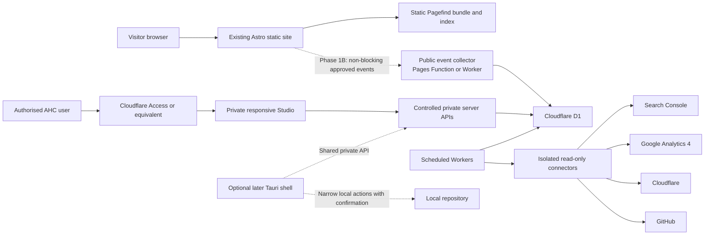

# Australian Home Collective Publication Intelligence Studio

| Field | Value |
| --- | --- |
| Status | Approved for phased implementation |
| Version | 1.1 |
| Date | 26 July 2026 |
| Scope | Australian Home Collective only |
| Working product name | AHC Studio |
| Document type | Internal product, architecture and implementation blueprint |
| Owner | Australian Home Collective |

### Version history

| Version | Date | Amendment |
| --- | --- | --- |
| 1.1 | 26 July 2026 | Phase 1A implementation amendment: `public/_headers` is an approved required change because self-hosted Pagefind uses WebAssembly and a Web Worker. The existing CSP therefore adds only `script-src 'wasm-unsafe-eval'` and `worker-src 'self' blob:`; it does not add `'unsafe-eval'` or a new origin. |
| 1.0 | 26 July 2026 | Approved Phase 0 blueprint and contracts. |

## 1. Document purpose and authority

This blueprint is the implementation source of truth for AHC Studio. It records the approved product boundaries, editorial rules, data contracts, privacy controls, architecture, phased delivery plan and the implementation contract for Phase 1A.

Future development sessions must be able to implement an approved phase from this document and the repository without relying on chat history. A phase may add a more detailed specification, migration plan or test plan, but it must not weaken this blueprint without a recorded human decision and a new blueprint version.

This document extends, rather than replaces, the existing publishing foundation:

- [Publishing Standards Manual](../governance/publishing-standards-manual.md)
- [Editorial Charter](../governance/editorial-charter.md)
- [Editorial Decision Framework](../governance/editorial-decision-framework.md)
- [Editorial Style Guide](../editorial/editorial-style-guide.md)
- [Recommendation Methodology](../editorial/recommendation-methodology.md)
- [Retail Knowledge Base](../knowledge/retail-knowledge-base.md)
- [Planning Tool Standard](../tools/planning-tool-standard.md)
- [Legal and risk register](../legal/README.md)

Those documents continue to govern publication quality. The Editorial Constitution in this blueprint adds Studio-specific decision controls, including a stricter employer-conflict boundary for future recommendations. It does not authorise an unreviewed change to existing public pages. If two rules genuinely conflict for a proposed action, the stricter rule applies until the owner records a reconciliation.

Phase 0 creates documentation only. It introduces no search, analytics event, database, dashboard, connector, Worker, Pages Function, desktop application or deployment capability.

## 2. Repository baseline

The following baseline was inspected on 26 July 2026. Counts are evidence about this repository state, not permanent product constants; implementation work must recalculate them before relying on them.

### 2.1 Application and deployment

- The public site is a statically generated Astro site using Astro `^7.0.6`, Node.js `>=22.12.0` and no framework or Astro integration beyond core Astro.
- `astro.config.mjs` currently exports an empty `defineConfig({})`; there is no server adapter.
- `package.json` has one runtime dependency, `astro`, and no search dependency.
- `dist/` is the generated public output and is ignored by Git.
- The repository README records Cloudflare Pages as the production host. Cloudflare watches the connected GitHub repository's `main` branch, runs `npm run build` and publishes `dist`.
- `.github/workflows/deploy.yml` builds and audits pushes and pull requests but does not deploy. It uses Node.js 22, runs `npm ci`, the commercial source audit, the production build and the rendered commercial audit.
- There is no committed Wrangler configuration or Cloudflare project configuration. Production variables, secret values and Pages project state are managed outside the repository.
- `public/_headers`, `public/_redirects` and `public/_routes.json` are the committed Cloudflare-facing controls. The current Pages Function include list contains only `/api/contact`.

### 2.2 Page and content structure

- `src/pages/guides/` contains 104 route files: 98 active guides using `ArticleLayout.astro`, the `/guides/` index and five noindex moved-guide routes using `BaseLayout.astro`.
- Each active guide is an Astro page with literal `ArticleLayout` properties for title, optional SEO title, description, category, display date, machine-readable publication or modification date, reading time, FAQs, image and image alt text.
- `src/pages/categories/` contains the category index and ten populated category hubs. Nine use `SimpleCategoryPage.astro`; Nursery & Kids uses `CategoryHubLayout.astro` directly.
- Category guide lists and the `/guides/` index are maintained as explicit arrays in their Astro source pages.
- `src/data/guideMetadata.ts` and `src/data/guideNavigation.ts` use eager raw `import.meta.glob` reads of guide source files. They parse literal component properties and explicit guide links to derive card metadata and previous/category/next navigation.
- `src/data/categories.ts` maps category labels to category routes. `src/data/socialImages.ts` maps category labels to social images.
- There is no Astro content collection, complete content manifest or publication graph. `src/data/commercial-products.json` is a controlled commercial data source, not a complete editorial manifest.
- `public/sitemap.xml` is committed and maintained explicitly. At inspection it contained 119 URLs.
- The inspected `dist/` contained 140 HTML files. The current roadmap records 98 indexable guides and ten populated category pages.

### 2.3 Navigation and responsive behaviour

- `src/components/SiteHeader.astro` defines one fixed `navItems` array for Home, Categories, Guides, How We Select, About and Contact.
- The same semantic `<nav>` is used at every viewport. CSS in `public/styles/global.css` keeps it inline on larger screens and wraps it below the brand on narrower screens. There is no separate mobile menu, drawer or navigation data source.
- A Phase 1A search entry must therefore extend this one navigation array and preserve its existing responsive and keyboard behaviour.

### 2.4 Functions, tests and audits

- `functions/api/contact.js` is the only Pages Function. It handles `/api/contact`, validates same-origin form submissions, validates Cloudflare Turnstile and sends to one server-configured verified destination.
- `tests/contact-function.test.mjs` is the only test file and is run with Node's built-in test runner.
- The production `build` script runs Astro and five rendered/source consistency audits:
  - `scripts/audit-site-output.mjs`
  - `scripts/audit-featured-guide-images.mjs`
  - `scripts/audit-guide-navigation.mjs`
  - `scripts/audit-category-consistency.mjs`
  - `scripts/audit-continue-exploring.mjs`
- Separate commands audit commercial source data, rendered commercial data and the contact Function.
- `scripts/audit-site-output.mjs` checks metadata, canonicals, Open Graph data, links, sitemap coverage, structured data, FAQs, inbound discovery and selected editorial boundaries. It treats `noindex` pages as intentionally absent from the sitemap.

### 2.5 Documentation

- `docs/README.md` is the canonical documentation index.
- There was no `docs/blueprints/` directory before this document.
- The existing governance, editorial, legal, knowledge, tool and roadmap documents overlap with the Studio's editorial decisions. This blueprint references them and adds operational contracts rather than duplicating their complete text.
- The Planning Centre roadmap records that no interactive public tool is currently approved. A Studio recommendation to build a tool is therefore only a proposal requiring a fresh Editorial Decision Framework record; it is not permission to implement a tool.

### 2.6 Baseline consequences for the design

1. Pagefind is compatible with the static `dist/` output and does not require an Astro adapter or hosted search service.
2. Search indexing must run after `astro build` and before the rendered audits and deployment complete.
3. Index scope should be opt-in at the shared layout level so active guides and populated category hubs are included while moved routes, legal pages and template boilerplate remain excluded.
4. A future content manifest must reconcile literal page metadata and explicit link arrays rather than assuming a content collection exists.
5. Phase 1A must not add a Pages Function or change `public/_routes.json`; those belong to Phase 1B.
6. The current Google tag in `BaseLayout.astro` is existing site behaviour. Phase 1A must add no search-specific analytics and must not expose a typed query through a query string, event or new provider.
7. Release Assurance must distinguish the GitHub Actions build from the separate Cloudflare Pages deployment.

## 3. Product definition

AHC Studio is:

> A private, evidence-first publication decision system that converts reader demand, search performance, content structure and operational health into transparent, human-approved actions.

Its three primary outcomes are:

1. Select the highest-value work.
2. Reject weak, duplicative or unsuitable ideas.
3. Measure whether completed work produced a useful result.

The default interface prioritises decisions and their evidence. Charts are supporting views, not the product's organising principle.

AHC Studio is not:

- a generic analytics dashboard;
- a replacement for Google Search Console, Google Analytics or Cloudflare;
- an automatic article generator;
- an automatic publishing system;
- a public-facing dashboard;
- a visitor-profiling system;
- a multi-tenant SaaS product at this stage;
- a reason to publish content merely because a keyword exists;
- a substitute for editorial judgement, authoritative sources or legal advice; or
- a mechanism for rewarding page-count growth.

## 4. Mandatory product principles

### 4.1 Evidence before recommendation

A recommendation must cite the signals that support it, the signals that weaken it, their provenance and freshness. Missing data is not evidence of zero demand.

### 4.2 Human control

Every recommendation is a hypothesis for review, not an authoritative instruction. Human approval is required before creating a brief and again before any write, local repository mutation, Git operation or deployment action. No phase introduces automatic publishing, content rewriting, Git pushes or production deployments.

### 4.3 Read-only integrations first

External connectors begin with the narrowest read-only access that can answer the approved question. Write scopes require a later, explicit decision and are not anticipated by this blueprint.

### 4.4 Single-site implementation

The first implementation serves Australian Home Collective only. Relational records include a simple `site_id` so the data need not be rewritten if the model later proves useful elsewhere. This is not approval for tenancy, customer accounts, billing or cross-site data access.

### 4.5 Separate decision dimensions

The Studio must not display an opaque combined “health score”. Priority, confidence, urgency and estimated effort are separate fields with separate explanations. A high-priority, low-confidence hypothesis must remain visibly different from a high-priority, high-confidence action.

### 4.6 Evidence and counterevidence

Every evidence card contains supporting evidence and counterevidence or limitations. “No counterevidence found” is allowed only when the sources checked are named; it must not imply that none exists.

### 4.7 Honest uncertainty

Weak, partial, delayed, sampled, thresholded, stale or incomplete evidence is labelled. Recommendations are not generated from malformed or incomplete imports.

### 4.8 Failure isolation

Public pages and Pagefind search must continue if event logging, D1, the private Studio or a connector fails. One connector failure must not block another. Optional services may degrade; the public publication must not.

### 4.9 Cached data over live dependency

Scheduled, paginated and restartable imports write timestamped snapshots. Studio views use the last complete snapshot with a visible freshness warning rather than depending on provider availability during every page view.

### 4.10 Visible provenance

Metrics and recommendations expose their source system, property, date range, filters, import run, schema version and last successful refresh.

### 4.11 Privacy minimisation

Collect the smallest amount of information needed for a defined decision. Do not create persistent visitor identities, store personal search data or repurpose field notes as customer records.

### 4.12 Prevent fluff

The Studio should often recommend improving, consolidating, clarifying, linking, adding a synonym, building a checklist, monitoring or taking no action. A new page is justified by reader usefulness and distinct topic ownership, not by the existence of a query.

## 5. Editorial Constitution

### 5.1 Constitution version 1.0

| Field | Value |
| --- | --- |
| Constitution version | 1.0 |
| Effective date | 26 July 2026 |
| Status | Active for AHC Studio decisions |
| Source | Existing AHC publishing foundation plus approved Studio boundaries |

Every recommendation must be evaluated against the following rules before it is shown as actionable:

1. Practical usefulness must justify publication.
2. Never claim or imply product testing, ownership, inspection or hands-on experience that did not occur.
3. Do not make unsupported “best”, “top”, winner, ranking or universal-superiority claims.
4. Use suitability-based guidance that explains who an option may or may not suit.
5. Do not use hype, manufactured urgency, artificial scarcity or fear.
6. Use Australian English and clear language for capable adults.
7. Do not recommend retailer, competitor-publication or affiliate-site links.
8. External links must be relevant, high-trust sources. Public external links must use the repository's approved new-tab and `noopener noreferrer` treatment where applicable.
9. Do not publish speculative prices. A price may be used only when it is current, verified, dated, relevant and maintainable.
10. Do not create an article solely to increase page count.
11. Avoid unnecessary duplication and keyword cannibalisation.
12. Prefer improving an existing guide when it already owns the reader problem.
13. Consider whether a calculator, checklist, Pagefind alias, search synonym, internal link or new section solves the problem better than a new article.
14. Reject topics outside Australian Home Collective's home-planning and buying-decision scope.
15. Reject content with unacceptable legal, factual, cultural, privacy, safety or employer-conflict risk.
16. Do not recommend new or expanded Australian Consumer Law or product-care-plan content because of the established employer-conflict boundary. This is a stricter Studio decision rule than the limited general treatment described in some existing standards; it controls new Studio recommendations unless a later constitution version records an approved reconciliation.
17. Do not store personal customer information or commercially confidential employer information in Field Notes.
18. AI-generated candidates must pass these rules before presentation. A model must not silently waive, reinterpret or score around a failed rule.

### 5.2 Versioning and traceability

Constitution versions are immutable after activation. A new version records:

- version identifier;
- complete rule set or a content-addressed snapshot;
- effective date and optional retirement date;
- owner and approval record;
- summary of changes;
- reason for the change; and
- migration or review consequences for open recommendations.

Every recommendation and decision stores the constitution version used. A later rule change does not rewrite the historical reason for an earlier decision. Open recommendations affected by a stricter rule must be rechecked and labelled.

## 6. Recommendation taxonomy

The Studio may recommend:

- create a new guide;
- improve or expand an existing guide;
- consolidate or merge overlapping content;
- clarify the distinct purpose of potentially competing pages;
- add or repair internal links;
- add Pagefind metadata, aliases or search synonyms;
- improve a title or search-result description;
- create a checklist;
- create an interactive tool or calculator;
- add a missing section to an existing guide;
- refresh outdated information;
- investigate a technical issue;
- monitor until more evidence exists;
- reject or archive the idea; or
- take no action.

A zero-result search is a discovery signal, not an automatic new-article recommendation. The same query can produce different actions:

| Situation | Appropriate response |
| --- | --- |
| Search cannot locate an existing guide that answers the problem | Improve Pagefind metadata, an alias or search wording. |
| An existing guide partly answers the query | Expand the existing guide after editorial review. |
| The query expresses a repeatable measurement or comparison problem | Consider a checklist or tool under the Planning Tool Standard. |
| The query is highly specific and weakly supported | Monitor for more evidence. |
| The query is outside publication scope | Reject and record the reason. |
| Two guides overlap | Consolidate them or clarify topic ownership. |
| The result is already satisfactory | Take no action and record why. |

## 7. Evidence card contract

Every recommendation card must contain:

| Field | Contract |
| --- | --- |
| Recommendation ID | Stable, opaque identifier. |
| Site ID | `ahc` initially; never inferred from a visitor. |
| Recommended action | One value from the recommendation taxonomy. |
| Affected page or topic | Canonical page ID or a clearly bounded topic. |
| Reader problem | Plain-language decision or difficulty being addressed. |
| Supporting evidence | Source-specific observations with dates and values. |
| Counterevidence and limitations | Conflicts, gaps, alternative explanations and unavailable evidence. |
| Source provenance | Source system, property, filters, import run and schema version. |
| Data date range | Inclusive period represented by the evidence. |
| Last data refresh | Last successful complete refresh, not merely the last attempt. |
| Priority | Critical, High, Medium or Low, with rationale. |
| Confidence | High, Medium, Low or Insufficient evidence, with rationale. |
| Urgency | Immediate, This week, This month or Monitor, with rationale. |
| Estimated effort | Under 30 minutes, 30–90 minutes, Half day, One day or Multi-day. |
| Constitution checks | Version and pass, fail or needs-review result for each applicable rule. |
| Risks | Editorial, factual, legal, cultural, privacy, technical, operational and employer-conflict risks. |
| Proposed success measures | Observable measures tied to the reader problem. |
| Measurement window | Earliest useful review date and intended comparison period. |
| Current decision state | Proposed, Under review, Approved, Modified, Deferred, Monitored, Rejected, Briefed, Implemented, Measuring, Reviewed or Closed. |
| Decision history | Append-only dated human decisions and reasons. |

Priority, confidence, urgency and effort must never be collapsed into one unexplained score. Sorting may use one field at a time or a transparent sequence chosen by the user; the stored values remain separate.

### 7.1 Complete illustrative evidence card — not real site data

The following card is deliberately fictional. Its counts, query and dates are examples only.

| Field | Example |
| --- | --- |
| Recommendation ID | `rec_example_001` |
| Site ID | `ahc` |
| Recommended action | Monitor until more evidence exists |
| Affected page or topic | Indoor drying-rack clearance guidance; illustrative topic only |
| Reader problem | A reader wants to know how much walking space to leave around an indoor drying rack. |
| Supporting evidence | Three fictional settled searches used similar wording during a fictional 28-day period; one fictional Field Note described a walkway obstruction. |
| Counterevidence and limitations | The sample is very small; the searches may come from one household; an existing laundry guide may already answer the problem; no Search Console corroboration is available. |
| Source provenance | Illustrative search snapshot and illustrative Field Note; no connection to production data; schema version `example-1`. |
| Data date range | 1–28 June 2026, fictional |
| Last data refresh | 29 June 2026, fictional |
| Priority | Low — possible inconvenience but no demonstrated widespread gap |
| Confidence | Insufficient evidence — too few independent signals |
| Urgency | Monitor |
| Estimated effort | Under 30 minutes to review again |
| Constitution checks | Version 1.0; usefulness needs review; duplication needs review; all prohibited-topic checks pass in this fictional example |
| Risks | Overreacting to a tiny sample; duplicating an existing guide; implying a universal clearance |
| Proposed success measures | More independent searches, corroborating Search Console demand or repeated non-identifying observations |
| Suggested measurement window | Review after another 8 weeks |
| Current decision state | Monitored |
| Decision history | 29 June 2026, fictional — monitor; do not create content from the current evidence |

## 8. Closed editorial feedback loop

The lifecycle is:

```text
Signal
→ Recommendation
→ Human decision
→ Brief
→ Implementation
→ Build and audit
→ Commit and deployment
→ Canonical live verification
→ Measurement window
→ Outcome review
→ Recorded lesson
```

| Stage | Information retained |
| --- | --- |
| Signal | Source, property, date range, import run, raw allowed fields or aggregate, freshness and limitations. |
| Recommendation | Evidence card, constitution version, expected reader benefit, risks and proposed success measures. |
| Human decision | Decision, date, owner, reason, modification, deferral or rejection code and next review date. |
| Brief | Approved scope, non-goals, affected content, evidence to preserve, acceptance criteria and required reviews. |
| Implementation | Files or pages changed, tests added, assumptions and deviations from the brief. |
| Build and audit | Commands, results, route and sitemap counts, failures and approvals for any exceptions. |
| Commit and deployment | Git commit, branch, deployment identifier, deployment status and date deployed. |
| Canonical live verification | Canonical URL, response, deployed commit, critical asset checks and manual feature result. |
| Measurement window | Baseline metrics, start and end dates, comparison method and known seasonality or confounders. |
| Outcome review | Actual observed result, uncertainty, alternative explanations and whether the expected outcome occurred. |
| Recorded lesson | Whether and how this result should influence similar future recommendations. |

An observed change after implementation is correlation, not proof of causation. Outcome language must disclose concurrent edits, seasonality, ranking changes, data gaps, low volume and any other plausible confounding factor.

## 9. Decision ledger

The decision ledger is permanent and append-only at the event level. It records:

- recommendation and version;
- human decision;
- decision date and actor;
- approved, modified, deferred, monitored or rejected status;
- reason;
- relevant Editorial Constitution rule and version;
- review date when deferred or monitored;
- implementation and outcome when applicable; and
- whether materially similar recommendations should be suppressed.

Standard rejection reasons include:

- too thin;
- duplicates an existing guide;
- existing guide should be improved instead;
- outside scope;
- weak evidence;
- commercially irrelevant;
- impractical to cover reliably;
- legal or factual risk;
- employer conflict;
- privacy concern;
- requires unavailable data; and
- not currently worth the effort.

A rejection creates a suppression record based on site, normalised topic, affected content, recommendation type and constitution version. The Studio may resurface it only when materially new evidence exists, a review date arrives or the governing rule changes. It must show the earlier rejection and explain what changed; it must not present the idea as new.

## 10. Field Notes

Field Notes is a private inbox for non-identifying observations about household planning and buying problems. A note is qualitative context, not a customer record, employer record or statistically representative sample.

Allowed fields are:

- note ID;
- date observed;
- concise anonymised observation;
- product or room category;
- frequency classification;
- consequence classification;
- related existing content;
- possible response type;
- review state; and
- employer-conflict flag.

Frequency classifications:

- Observed once
- Occasional
- Recurring
- Very common

Consequence classifications:

- Minor inconvenience
- Purchase mistake risk
- Delivery or installation risk
- Safety concern requiring authoritative sourcing
- High financial consequence

Never store:

- customer names;
- email addresses;
- phone numbers;
- addresses;
- order numbers;
- employer records;
- identifiable quotations;
- payment information;
- staff identifiers;
- exact dates or locations that make a person identifiable; or
- any other personal or commercially confidential information.

The entry interface must repeat this prohibition, minimise free text and provide a safe delete path. A note with possible personal or confidential information is rejected or quarantined for human deletion; it is not passed to an AI system.

Field Notes can be compared with internal search and Search Console evidence by topic and time period. Agreement between sources may increase confidence that a problem deserves investigation, but it is not statistical proof: notes are observer-selected, frequency labels are qualitative and the same underlying event may influence more than one source.

## 11. Visitor search architecture

Pagefind is the approved proposed visitor search engine. Repository inspection found no material incompatibility: the site generates static HTML, uses `en-AU` on the root document and can create the index after Astro writes `dist/`.

The visitor experience will provide:

- a dedicated `/search/` page;
- a text search entry in the existing desktop navigation;
- the same accessible entry in the wrapped mobile navigation;
- client-side search against static, same-origin Pagefind assets;
- keyboard navigation and visible focus;
- an informative initial state with curated suggested searches;
- a useful zero-result state;
- result title, category, description or highlighted excerpt and URL;
- relevant term highlighting in excerpts;
- no dependence on a hosted search provider; and
- working search when future event logging is unavailable.

Index scope:

| Include | Exclude or de-prioritise |
| --- | --- |
| Active published guides using `ArticleLayout.astro` | Site navigation and footer |
| Ten populated category hubs using `CategoryHubLayout.astro` | Moved or redirect-like guide and collection routes |
| Future approved practical tools and calculators that explicitly opt in | Legal, privacy, contact and trust-page boilerplate |
| Explicit search metadata and approved aliases | Contact form labels and hidden interface text |
| Useful, unique guide and category body text | Repeated disclosure, guide-navigation and related-guide blocks |
| Unique FAQs where they improve discovery | Repeated category guide-card collections and duplicate template text |
|  | The `/search/` page itself |

Pagefind must index the generated HTML, not source assumptions. Every implementation build records which routes were indexed and tests representative queries against the built output.

## 12. Privacy-safe search event model

This model is approved for Phase 1B design only. Phase 1A implements no event endpoint or event submission.

### 12.1 Event types

`search_performed`:

- `search_id`: cryptographically random identifier for this submitted search only;
- `site_id`;
- `redacted_query`;
- `normalised_query`, derived only after redaction;
- `result_count`;
- `search_context`;
- `occurred_at`; and
- `schema_version`.

`result_clicked`:

- `search_id`;
- `site_id`;
- `result_url`;
- `result_position`;
- `occurred_at`; and
- `schema_version`.

There is no persistent visitor ID.

### 12.2 Prohibited search data

Do not store:

- IP addresses;
- Cloudflare connecting IP values;
- cookies solely for search analytics;
- browser fingerprints;
- full user-agent strings;
- persistent session profiles;
- email addresses;
- phone numbers;
- unredacted personal information;
- contact-form data; or
- a raw query alongside a redacted query.

Edge rate limiting may use transient request properties without writing them to logs or D1. The event schema must have no field for those properties.

### 12.3 Collection safeguards

- Do not record keystrokes or intermediate text.
- Record only a deliberately submitted or settled query.
- Require a configurable minimum length, initially proposed as two visible characters.
- Trim whitespace and cap accepted input, initially proposed at 120 Unicode characters.
- Normalise whitespace and case for analysis after redaction.
- Redact email-like, phone-like and URL-like content before storage.
- When redaction triggers, never persist the unredacted form.
- Reject empty, malformed, oversized or unknown-schema events.
- Validate an allowlist of event fields, types and same-site result URLs.
- Apply request-size, content-type, origin where appropriate, rate-limit and abuse controls.
- Use non-blocking, best-effort submission from the browser.
- Never allow a logging failure or timeout to delay results or navigation.
- Never promote raw search terms publicly without editorial review.

### 12.4 Retention

The provisional design target is 90 days for detailed redacted events and up to 25 months for non-identifying aggregates. Both values must be configurable, documented and approved in the Phase 1B privacy review before production logging. Aggregation and deletion jobs require dry-run, boundary and idempotency tests. This blueprint is not legal advice, and the public Privacy Policy must be reviewed before collection begins.

## 13. Content manifest and publication graph

### 13.1 Current-source reconciliation

There is no complete manifest today. A future generator must use the repository's actual sources:

- active guide routes and literal layout properties in `src/pages/guides/**/index.astro`;
- category route mapping in `src/data/categories.ts`;
- explicit guide ordering and links in category pages and `src/pages/guides/index.astro`;
- existing raw-source parsing behaviour in `src/data/guideMetadata.ts` and `src/data/guideNavigation.ts`;
- rendered canonicals and internal or external links in `dist/`; and
- publication status inferred from active layout use, robots directives and canonical behaviour.

A future proposed `scripts/build-content-manifest.mjs` fits the existing script convention. Its internal-output location must be defined in its implementation specification and must not publish private editorial fields into public `dist/`. Public facts and private Studio enrichment may be separate records joined by stable content ID.

### 13.2 Manifest contract

The generated manifest should expose, where available:

- stable content ID;
- title;
- description;
- canonical URL;
- content type;
- category;
- publication status;
- publication date;
- last substantive update date;
- search aliases;
- reader problems addressed;
- product or room entities;
- internal outgoing links;
- internal incoming links;
- related guides;
- authoritative external sources;
- tool or calculator relationships;
- editorial owner or topic-owner page; and
- content schema version.

Unknown values remain `null` or absent according to the schema; they are not guessed. Stable IDs must survive title and URL changes, while URL history is retained separately.

### 13.3 Initial publication graph

Initial relationships are:

- page to category;
- page to reader problem;
- page to query;
- page to related page;
- page to internal link;
- page to external source;
- page to tool;
- query to clicked result;
- recommendation to affected page;
- change to deployment; and
- deployment to measured outcome.

Deterministic metadata, links and explicit editorial relationships come first. Do not introduce a vector database or embedding infrastructure until ordinary full-text search, metadata and deterministic relationships have demonstrated and documented a material limitation.

## 14. Conceptual D1-compatible data model

This is a relational contract, not a migration. No D1 resource or migration is created in Phase 0. Use SQLite-compatible types: opaque IDs and timestamps as `TEXT`, booleans as constrained `INTEGER`, numeric metrics as `INTEGER` or `REAL`, and structured secondary data as validated JSON text only where normalised columns are not practical. Use UTC ISO 8601 timestamps.

| Table | Purpose and major fields | Key and relationships | Likely indexes | Data classification and retention |
| --- | --- | --- | --- | --- |
| `sites` | Site registry: `site_id`, name, canonical origin, status, timezone, schema version. | PK `site_id`. Parent of site-scoped records. | Unique canonical origin; status. | Internal configuration; retain while site exists and through archive obligations. |
| `content_items` | Publication identity and manifest snapshot: content ID, site, canonical URL, type, title, description, category, status, dates, manifest version. | PK `content_id`; FK `site_id`. | Unique site + canonical URL; site + type + status; category. | Public metadata plus internal status; retain URL history and tombstones permanently. |
| `content_relationships` | Typed graph edges with source, target or external value, provenance and schema version. | PK `relationship_id`; FKs site, source content and optional target content. | Source + type; target + type; unique deduplication key. | Mostly public/internal metadata; retain with related content history. |
| `search_events` | Privacy-minimised settled searches: search ID, site, redacted and normalised query, result count, context, time, schema version. | PK `search_id`; FK `site_id`. | Site + occurred time; site + normalised query + time. | Restricted user-provided data even after redaction; short configurable retention, provisionally 90 days. |
| `search_clicks` | Result selection for a single search: click ID, search ID, site, result URL, position, time, schema version. | PK `click_id`; FKs `search_id`, `site_id`. | Search ID; site + occurred time; result URL. | Restricted event data; no persistent visitor link; expire with or before detailed search event. |
| `field_notes` | Anonymised qualitative observations, classifications, related content, response type, review state and conflict flag. | PK `note_id`; FKs `site_id`, optional `content_id`. | Site + review state; category; observed date. | Restricted internal data; review regularly, delete unsafe notes immediately and archive only anonymised useful records. |
| `recommendations` | Current recommendation card: action, topic, reader problem, dimensions, effort, state, constitution version, measurement proposal, schema version. | PK `recommendation_id`; FKs site, optional content and constitution version. | Site + state; priority; urgency; affected content; normalised topic. | Internal editorial decision data; retain permanently with archive state. |
| `recommendation_evidence` | Supporting or counter evidence: source, observation, date range, provenance, limitations, freshness and import run. | PK `evidence_id`; FK recommendation; optional FK sync run or metric. | Recommendation + evidence type; source + date range. | Inherits source classification; retain with decision record, purge linked detailed events when required and preserve aggregates. |
| `recommendation_decisions` | Append-only decision ledger: status, reason, rule, actor, date, review date, suppression and supersession. | PK `decision_id`; FKs recommendation and constitution version. | Recommendation + decision date; status + review date; suppression key. | Restricted governance record; permanent unless a legal retention decision requires otherwise. |
| `editorial_tasks` | Approved brief and task state: scope, non-goals, acceptance criteria, owner, dates and linked recommendation. | PK `task_id`; FKs site and recommendation. | Site + status; recommendation; due date. | Internal operational data; retain with completed change history. |
| `implemented_changes` | What changed: summary, files or pages, commit, implementation date and task. | PK `change_id`; FKs task, recommendation, deployment where known. | Commit; content ID; implementation date. | Internal release record; permanent. |
| `deployments` | Source, GitHub and Cloudflare identifiers, commit, environment, status, timestamps, route and sitemap counts. | PK `deployment_id`; FK site; optional links to changes. | Site + environment + created time; commit; status. | Internal operational metadata; permanent or long-lived. Never store secret values. |
| `live_verifications` | Canonical and feature checks: deployment, URL, check type, result, status code, observed commit and time. | PK `verification_id`; FK deployment. | Deployment + check type; URL + verified time; result. | Internal operational record; retain with deployment. Response bodies only when scrubbed and necessary. |
| `measurements` | Baseline and post-change measurement definitions and observations: metric, source, period, value, uncertainty and import run. | PK `measurement_id`; FKs recommendation, outcome and optional sync run. | Recommendation + period; source + metric + period. | Aggregated analytical data; retain according to provider and business policy. |
| `outcomes` | Outcome review: expected and observed result, uncertainty, confounders, conclusion and lesson eligibility. | PK `outcome_id`; FKs recommendation and change. | Recommendation; review date; conclusion. | Internal editorial learning; permanent. |
| `connector_accounts` | Connector configuration metadata: provider, property identifier, scopes, status, token reference, timestamps. | PK `connector_account_id`; FK site. | Site + provider; status. | Restricted security metadata. Store only a secret reference, never a provider token; retain until revoked plus audit requirement. |
| `connector_sync_runs` | Each import attempt: connector, range, cursor summary, started and finished times, state, counts, partial flag and scrubbed error. | PK `sync_run_id`; FK connector account. | Connector + started time; state; range. | Restricted operational data; retain long enough for trend and incident review; scrub errors. |
| `imported_metrics` | Cached provider metrics with dimensions, date, value, source property, sync run, filters and schema version. | PK `metric_id`; FKs site and sync run; optional content ID. | Site + source + metric + date; content + date; deduplication key. | Aggregated analytics; provider-policy and configured retention; never interpret missing rows as zero. |
| `editorial_constitution_versions` | Immutable constitution snapshot, hash, status, effective dates, owner, approval and change summary. | PK `constitution_version_id`. Referenced by recommendations and decisions. | Effective date; status; unique content hash. | Internal governance; permanent. |
| `audit_events` | Administrative audit trail: actor, action, target, before and after summaries, request or job correlation and time. | PK `audit_event_id`; FK site where applicable. | Site + occurred time; actor; action + target. | Restricted security/governance record; defined long-term retention with redaction and access controls. |

Foreign-key enforcement must be enabled for migrations and tested. Event and manifest tables include `schema_version` where evolution is expected. Migrations are ordered, reversible where practical, backed up before destructive change and never run automatically against production from a browser.

## 15. Proposed system architecture



### 15.1 Boundaries

- **Public site:** existing static Astro output, static Pagefind index and, from Phase 1B only, best-effort event submission.
- **Public event collector:** validates, redacts, rate-limits and writes only allowlisted event fields. It has no editorial or connector administration capability.
- **Data layer:** D1 is the initial relational store. Public-event write access and private Studio access use separate endpoints and permissions.
- **Scheduled imports:** isolated jobs import and cache provider data, record run health and never make the Studio page view depend on live provider success.
- **Private Studio:** responsive web application first, protected before application code runs, using server-side APIs and no browser-held provider credentials.
- **Optional desktop:** considered only when local repository, build or audit actions deliver clear value. Capabilities remain narrow, confirmed and signed.

A Studio, connector, D1 or event-collector outage must not impair the static public site. Pagefind is served from the deployed static output and remains independent of D1.

## 16. External connector contracts

### 16.1 Common contract

Every connector requires:

- least-privilege permissions and read-only scopes first;
- provider tokens stored server-side in an approved secret store;
- no credentials or refresh tokens in frontend bundles, D1 values, Git or logs;
- property or site identity;
- last attempted and last successful sync timestamps;
- explicit import date range and filters;
- complete pagination or a visible partial flag;
- bounded retry with backoff and jitter;
- provider-specific rate-limit handling;
- partial-import detection and restartability;
- idempotent writes or deterministic deduplication where practical;
- scrubbed error recording;
- revocation and deletion process;
- source provenance and schema version; and
- independent health state so one connector cannot block another.

### 16.2 Google Search Console — Phase 3

Import query and page performance, clicks, impressions, CTR, average position, date range and data freshness. Record row limits, thresholding and incomplete ranges. Use scheduled imports, not constant live requests. Existing-content matching must be explainable and reviewable.

### 16.3 Google Analytics 4 — separately approved, not earlier than Phase 3

Import only approved aggregated page-view and engagement indicators through quota-aware scheduled snapshots. Record reporting-identity, thresholding and sampling limitations. Do not infer unsupported motives or individual journeys. The existing public Google tag does not by itself authorise a Studio connector.

### 16.4 Cloudflare — Phase 5

Read deployment, Function health, request or operational aggregates and expected configuration binding names or timestamps. Distinguish requests from verified human readership. Never expose secret values and never claim a hidden secret is correct.

### 16.5 GitHub — Phase 5

Read the current `main` commit, recent changes, checks, build status and deployment linkage. No automatic commit, branch, push, pull request or merge capability.

### 16.6 Affiliate or revenue providers — Phase 7 at earliest

These connectors are explicitly deferred. Financial value remains separate from reader usefulness and cannot alter editorial priority without transparent safeguards, disclosure and a later constitution decision.

## 17. Data health and provenance

Every imported metric and every recommendation derived from imported data exposes:

- source system;
- source property or site;
- date range;
- last successful sync;
- current connector state;
- partial-data flag;
- applicable sampling, thresholding or row-limit warning;
- filters used;
- schema version; and
- import run ID.

Connector states are:

| State | Meaning |
| --- | --- |
| Healthy | Latest expected complete sync succeeded within its freshness window. |
| Delayed | A run is late or still processing, but the freshness window has not yet become stale. |
| Partial | A run completed without the full approved range or rows. |
| Stale | Last complete data is older than the source-specific freshness threshold. |
| Authentication required | Credentials are absent, expired or revoked. |
| Rate limited | Provider throttling prevented the expected complete import. |
| Failed | The latest attempt failed for a non-rate-limit reason. |
| Disabled | Human decision or feature control has stopped the connector. |

Missing, stale or partial data must not be rendered as zero. A recommendation whose required evidence is unavailable displays **Insufficient evidence** and cannot move to an actionable state automatically.

## 18. Release Assurance

Release Assurance verifies AHC behaviour without duplicating Cloudflare's dashboard. It eventually tracks:

- local or prepared commit;
- GitHub `main` commit;
- Cloudflare production deployment commit;
- deployment and build status;
- audit status;
- route count;
- sitemap URL count;
- unexpected route loss;
- critical asset checks;
- canonical-domain response;
- relevant Function route health;
- contact-form last verified date;
- search page and static index last verified date;
- manual feature-verification result; and
- expected configuration changes made after the active deployment.

The verification chain is:

```text
Source
→ Build
→ Commit
→ Push
→ Cloudflare deployment
→ Canonical domain
→ Feature-level live test
```

A successful build or Cloudflare deployment is not sufficient evidence of a working release. The canonical domain and the changed feature must be tested against the deployed commit.

Secret values remain hidden. The Studio may compare expected binding names and configuration timestamps, but it cannot prove a hidden value is correct. A relevant configuration change after the active production deployment triggers a redeploy-and-verify warning. No secret value is copied into a release record.

## 19. Private Studio user experience

Initial navigation:

- Today
- Evidence
- Search Intelligence
- Content
- Field Notes
- Decisions
- Releases
- Data Health
- Settings

### 19.1 Today

Show no more than three primary recommended actions. Each shows:

- why it matters;
- affected content or topic;
- estimated effort;
- confidence;
- urgency; and
- stale, partial or insufficient-data warning where applicable.

The default sort must be transparent. Lower-priority material remains available without turning Today into an infinite task list.

### 19.2 Evidence

Show supporting evidence and counterevidence together, with provenance, date range, refresh time, limitations, related pages and related queries. The user must not need to open a chart to learn why a recommendation exists.

### 19.3 Decision actions

Available actions are:

- Approve
- Modify
- Create brief
- Improve existing page
- Build a tool
- Add internal links
- Monitor
- Snooze
- Reject with reason

Actions that imply implementation still create an approved record or brief; they do not mutate the repository.

### 19.4 Weekly review

The weekly review contains:

- material changes only;
- completed work and measured outcomes;
- recommendations requiring review;
- content that should not be created;
- data-quality issues;
- deployment or site-health warnings; and
- recommendations that can safely be ignored.

Avoid walls of page views, impressions or other vanity metrics. A chart must answer a decision question.

## 20. Security model

Privacy and access are boundaries, not claims that the system is “secure because it is private”.

### 20.1 Access and identity

- Protect the Studio with Cloudflare Access or an equivalently strong private access layer.
- Deny private API calls that lack verified identity and authorisation.
- Keep an audit trail for administrative changes and destructive decisions.
- Separate development, preview and production identities, bindings and data.

### 20.2 Credentials

- Provider tokens remain server-side under least-privilege scopes.
- Do not commit secrets to Git, send them to browser JavaScript or include values in logs or D1.
- Store connector-account metadata and a secret reference only.
- Support explicit revocation and connector disablement.

### 20.3 Public events

- Accept only known versions and content types.
- Enforce small request bodies, field allowlists, value bounds and schema validation.
- Apply origin checks where appropriate, rate limiting and duplicate protection.
- Do not store personal search data or network identifiers.
- Escape or render all user-originated values as text.

### 20.4 D1

- Use controlled, numbered migrations and foreign-key checks.
- Back up or export before destructive production migrations.
- Test restore and recovery, not only backup creation.
- Give public event writes no access to administrative tables.
- Define retention and deletion jobs narrowly and test their boundaries.

### 20.5 Desktop boundary

- Desktop capabilities are disabled until Phase 6 is separately approved.
- Do not grant broad filesystem access.
- Restrict local access to the selected repository and approved commands.
- Require explicit confirmation before a local write, Git operation or deployment action.
- Use signed releases and updates.
- On failure, report repository state and never claim rollback unless it was verified.

## 21. Failure behaviour

| Failure | Required behaviour |
| --- | --- |
| Search event logging fails | Pagefind results and result navigation continue without delay. |
| D1 is unavailable | Public pages and Pagefind continue; Studio shows an outage without affecting the publication. |
| Studio is unavailable | Public site and scheduled connector isolation remain intact. |
| One connector fails | Other connectors continue; affected evidence is labelled with its last complete snapshot. |
| Scheduled import fails | Retain the last complete snapshot, label it stale or delayed and record the failed run. |
| Import is partial | Do not silently replace a complete snapshot; store separately or promote only with an explicit partial warning. |
| Data is malformed or incomplete | Quarantine or reject the run; create no recommendation from it. |
| Event is duplicated | Deduplicate by stable event key or accept idempotently without double-counting. |
| Import is retried | Use deterministic upsert or run-scoped staging so retry is safe where practical. |
| Pagefind runtime asset fails | `/search/` shows a plain fallback with links to Guides and Categories; other routes are unaffected. |
| Pagefind indexing fails during build | Fail the build so a stale or missing search index is not deployed as a successful release. |
| Data is stale | Display the actual last successful date; never relabel it current or convert absence to zero. |
| Error reaches a user | Explain the useful next step without exposing tokens, provider bodies or private configuration. |
| Cleanup runs | Delete only records inside the configured type and retention boundary; dry-run and test first. |
| Desktop local action fails | Stop, show the command outcome and verified Git status, and leave no unreported repository state. |

## 22. Phased implementation plan

No phase begins until the prior phase's exit criteria are met or a human records an explicit exception.

### Phase 0 — Blueprint and contracts

| Contract | Detail |
| --- | --- |
| Objective | Record complete product, editorial, architecture, privacy, security, data and delivery contracts without runtime implementation. |
| Dependencies and entry | Approved Studio direction; current repository inspection; canonical publishing documents. |
| Deliverables | This versioned blueprint and link from the existing docs index. |
| Acceptance and exit | Blueprint acceptance checklist passes; repository build and relevant audits pass; documentation commit is deployed or detected by Cloudflare. |
| Security checks | No secret values, credentials, personal data or new access surface. |
| Privacy checks | No data collection or schema resource exists. |
| Non-goals | Search, logging, D1, Studio UI, connectors, Workers, desktop code and runtime configuration. |
| Rollback or disable | Revert the documentation commit; no runtime state exists. |

### Phase 1A — Visitor search without analytics

| Contract | Detail |
| --- | --- |
| Objective | Add accessible, self-hosted Pagefind search to the public static site. |
| Dependencies and entry | Phase 0 complete; current build green; Pagefind version and official contracts rechecked. |
| Deliverables | Pagefind build step, `/search/`, navigation entry, indexing boundaries, result metadata, fallback UI and search audits. |
| Acceptance and exit | Built-index query matrix passes; accessibility and responsive checks pass; live canonical search works; no search event request occurs. |
| Security checks | Same-origin static assets only; safe highlighted markup from Pagefind; no unsafe query rendering; CSP verified. |
| Privacy checks | No query logging, search cookie, visitor identifier or query-string persistence; existing analytics receives no search term from the new feature. |
| Non-goals | D1, event endpoint, result-click tracking, Search Console, private Studio and content recommendations. |
| Rollback or disable | Revert search commit or remove nav entry and search build step; existing public pages remain intact. |

### Phase 1B — Privacy-safe search analytics

| Contract | Detail |
| --- | --- |
| Objective | Collect minimal settled-search and result-click evidence without persistent visitor tracking. |
| Dependencies and entry | Phase 1A verified; event threat model, retention decision and Privacy Policy review approved. |
| Deliverables | Pages Function or Worker endpoint, D1 migrations, redaction, validation, rate limiting, non-blocking client events, cleanup and tests. |
| Acceptance and exit | Prohibited data cannot enter D1; duplicate and malformed events are safe; logging-offline test proves search still works; retention jobs pass dry-run tests. |
| Security checks | Separate public write surface, field allowlist, small bodies, content type, abuse controls, no secret exposure and least-privilege D1 binding. |
| Privacy checks | No IP, persistent ID, fingerprint, full user agent or unredacted personal query; production notice approved. |
| Non-goals | Private Studio, external connectors, individual visitor journeys or automated recommendations. |
| Rollback or disable | Remove or feature-disable browser submission and event route; retain Pagefind; preserve or delete D1 data according to approved retention decision. |

### Phase 2 — Private Studio foundation

| Contract | Detail |
| --- | --- |
| Objective | Provide the private decision interface using internal search evidence and human Field Notes. |
| Dependencies and entry | Stable Phase 1B data contract; Cloudflare Access or equivalent; approved private API boundary. |
| Deliverables | Responsive private UI, Today, Search Intelligence, Field Notes, Decision Ledger, Data Health and constitution version display. |
| Acceptance and exit | Unauthorised access denied; evidence and counterevidence visible; decisions append to the ledger; no external connector exists. |
| Security checks | Private identity enforcement, CSRF/origin strategy, role checks, audit events, server-side validation and environment separation. |
| Privacy checks | Field Notes prohibit personal data; search-event retention shown; deletion path tested. |
| Non-goals | Search Console, GA4, GitHub, Cloudflare connectors, repository writes and desktop shell. |
| Rollback or disable | Deny Studio route or disable application feature while leaving public site, collector and stored records independent. |

### Phase 3 — Search Console intelligence

| Contract | Detail |
| --- | --- |
| Objective | Add explainable search-performance evidence and match it to existing content. |
| Dependencies and entry | Phase 2 foundation; approved Google project and least-privilege property access; import specification. |
| Deliverables | Scheduled imports, query and page trends, provenance, partial warnings, content matching and evidence cards. |
| Acceptance and exit | Pagination and date ranges verified; partial and thresholded data labelled; connector failure isolated; cards cite support and counterevidence. |
| Security checks | Server-side token, read-only scope, revocation, scrubbed errors and isolated scheduler. |
| Privacy checks | Aggregated provider data only; no unsupported user-level interpretation; retention recorded. |
| Non-goals | Live provider calls on every page, autonomous action, GA4 unless separately approved, revenue ranking or Git writes. |
| Rollback or disable | Disable schedule and connector; retain last snapshot as stale; Studio continues on internal search evidence. |

### Phase 4 — Editorial operating loop

| Contract | Detail |
| --- | --- |
| Objective | Close the loop from recommendation through brief, implementation record, measurement and lesson. |
| Dependencies and entry | Trusted evidence cards and decision ledger; human workflow approved. |
| Deliverables | Briefs, tasks, implemented-change records, measurement windows, outcome reviews and recorded lessons. |
| Acceptance and exit | Every implemented recommendation links to a decision, commit, deployment or explicit missing state, live verification and outcome review. |
| Security checks | Role and audit controls for decisions; no repository or provider write capability. |
| Privacy checks | Outcomes use aggregated evidence and do not reconstruct visitor profiles. |
| Non-goals | Automatic briefs published as content, automatic learning weights, content rewriting or production action. |
| Rollback or disable | Disable workflow modules while retaining the append-only decision and outcome history. |

### Phase 5 — Operational intelligence

| Contract | Detail |
| --- | --- |
| Objective | Reconcile source, build, GitHub, Cloudflare and canonical live behaviour. |
| Dependencies and entry | Phase 4 change records; approved read-only GitHub and Cloudflare access; verification specification. |
| Deliverables | Deployment reconciliation, route and sitemap checks, Function health, canonical verification records and configuration-change warnings. |
| Acceptance and exit | Commit identity matches across source and production; unexpected route loss alarms; feature checks prove more than deployment success. |
| Security checks | Read-only scopes, server-side tokens, hidden secret values, scrubbed provider responses and connector isolation. |
| Privacy checks | Operational aggregates are not treated as individual readership. |
| Non-goals | Deploy buttons, Git writes, Cloudflare configuration edits or duplication of provider dashboards. |
| Rollback or disable | Revoke connectors and continue manual release verification; no public runtime dependency. |

### Phase 6 — Optional desktop layer

| Contract | Detail |
| --- | --- |
| Objective | Decide whether narrow local repository, build and audit actions justify a signed Tauri shell. |
| Dependencies and entry | Documented web-interface limitation; Tauri feasibility and threat review; explicit capability approval. |
| Deliverables | If justified: scoped repository selection, Git inspection, controlled builds and audits, brief or prompt creation, signed updates and confirmations. |
| Acceptance and exit | Capability allowlist enforced; failures leave known Git state; no silent write, push or deployment; signed update path tested. |
| Security checks | OS credential storage where required, narrow filesystem scope, command allowlist, confirmation and audit trail. |
| Privacy checks | Local files are not uploaded without explicit purpose and approval. |
| Non-goals | Broad filesystem access, automatic content change, automatic Git or production action and replacing the private API. |
| Rollback or disable | Remove or disable desktop application; web Studio remains complete; revoke desktop credentials. |

### Phase 7 — Multi-site and commercial expansion

| Contract | Detail |
| --- | --- |
| Objective | Expand only after AHC evidence shows the operating model is useful and maintainable. |
| Dependencies and entry | Recorded AHC outcomes; explicit business, privacy, tenancy and connector decisions. |
| Deliverables | Additional publications through `site_id`; strict site isolation; separately approved revenue snapshots and usefulness separation. |
| Acceptance and exit | Cross-site access tests pass; editorial usefulness remains independent from financial value; operating cost and ownership are viable. |
| Security checks | Tenant-style isolation only if genuinely required, per-site permissions, secret separation and audit. |
| Privacy checks | Reassess notices, retention, lawful purpose and data separation for every site. |
| Non-goals | Premature SaaS, billing, open registration, shared visitor profiles or revenue-led editorial priority. |
| Rollback or disable | Disable or remove an added site's connectors and access without altering AHC records or schema history. |

## 23. Blueprint acceptance record

Phase 0 is complete only when review confirms:

- another development session can implement Phase 1A without this conversation;
- product goals and non-goals are unambiguous;
- the Editorial Constitution is explicit and versioned;
- the recommendation taxonomy includes non-article actions;
- supporting evidence and counterevidence are mandatory;
- priority, confidence, urgency and effort remain separate;
- search analytics avoid persistent visitor tracking;
- failure isolation is defined;
- provenance and freshness are defined;
- the decision ledger and rejection suppression are defined;
- Field Note privacy restrictions are explicit;
- the closed feedback loop and causation limitation are defined;
- Release Assurance includes canonical and feature verification;
- security boundaries are explicit;
- external integrations are deferred to named phases;
- desktop implementation is optional and justified only by local actions;
- no secret values or personal data appear;
- no runtime feature is implemented in Phase 0; and
- the Phase 1A contract below is concrete and testable.

## 24. Phase 1A implementation contract — Pagefind visitor search without analytics

This is the next approved implementation slice. It must be implemented as one reviewable change and must not include any Phase 1B behaviour.

### 24.1 Required repository changes

| Existing or proposed file | Required change |
| --- | --- |
| `package.json` | Add Pagefind as a development dependency; add an explicit search-index command; place indexing after Astro output and before rendered audits in `build`. |
| `package-lock.json` | Commit the exact resolved dependency tree. |
| `pagefind.yml` — new proposed root config | Set `site: dist`, keep output under `dist/pagefind` and define template-noise exclusion selectors. |
| `src/layouts/BaseLayout.astro` | Add explicit opt-in search-index properties; place `data-pagefind-body` on `<main>` only for approved page layouts; emit approved description, category and content-type metadata only for opted-in pages. |
| `src/layouts/ArticleLayout.astro` | Opt active guides into indexing and pass category plus `Guide` content type. |
| `src/layouts/CategoryHubLayout.astro` | Opt populated category hubs into indexing and pass category plus `Category` content type. |
| `src/components/SiteHeader.astro` | Add a text `Search` link to the one existing `navItems` array. Do not invent a separate mobile navigation. |
| `src/pages/search/index.astro` — new proposed route | Add the dedicated noindex search page, Component UI, curated suggestions, fallbacks and result template. |
| `public/styles/global.css` | Add site-consistent responsive styles and accessible focus, status, result, mark and fallback treatment. |
| `public/_headers` | Add Pagefind's same-origin WebAssembly and Worker CSP allowances: `script-src 'wasm-unsafe-eval'` and `worker-src 'self' blob:`. Do not add `'unsafe-eval'` or another origin. |
| `scripts/audit-pagefind-output.mjs` — new proposed audit | Check opt-in route scope, generated bundle presence, search page references, metadata, exclusions and navigation discovery. |
| `package.json` build/audit scripts | Run the new audit after Pagefind generation. |

Files explicitly not planned to change:

- `functions/` — no event endpoint in Phase 1A;
- `public/_routes.json` — `/api/contact` remains the only Function include;
- `public/sitemap.xml` — `/search/` is `noindex,follow` and must remain outside the sitemap;
- `astro.config.mjs` — Pagefind runs after the static build and requires no Astro adapter;
- public Privacy Policy — no new data collection occurs in Phase 1A; and
- public guide or category copy, except the minimal layout attributes required to index existing rendered content.

If implementation discovers that one of these files must change, stop and explain the reason before expanding scope.

### 24.2 Dependency and build sequence

At blueprint approval, Pagefind's official documentation reports version 1.5.2. Add `pagefind` as a development dependency using the repository's existing caret-and-lockfile convention, initially `^1.5.2`. Before installation, verify the current stable release and review breaking changes; a different major or materially different Component UI contract requires an implementation note.

Do not add a hosted search client or a frontend framework. Use the Component UI assets emitted by the Pagefind CLI, so a separate `@pagefind/component-ui` package is not planned.

Required script shape:

```json
{
  "scripts": {
    "index:search": "pagefind",
    "audit:search:dist": "node scripts/audit-pagefind-output.mjs",
    "build": "astro build && npm run index:search && node scripts/audit-site-output.mjs && node scripts/audit-featured-guide-images.mjs && node scripts/audit-guide-navigation.mjs && node scripts/audit-category-consistency.mjs && node scripts/audit-continue-exploring.mjs && npm run audit:search:dist"
  }
}
```

Keep all existing audit commands. The sequence is:

1. Astro renders the complete static site to `dist/`.
2. Pagefind reads the rendered HTML and writes `dist/pagefind/`.
3. Existing rendered and source-consistency audits run.
4. The Pagefind output audit verifies search-specific contracts.
5. Any indexing or audit failure fails the production build; do not deploy a stale index as a successful build.

`dist/pagefind/` remains generated and uncommitted because `dist/` is already ignored.

### 24.3 Proposed Pagefind configuration

The root `pagefind.yml` should begin with:

```yaml
site: dist
output_subdir: pagefind
exclude_selectors:
  - ".breadcrumbs"
  - ".article-meta"
  - ".related-guides"
  - ".guide-navigation"
  - "[data-category-section='guide-collection']"
  - "[data-category-section='nearby-categories']"
```

Verify every selector against rendered `dist/`. Remove a selector that hides unique useful content; add a selector only when a built-output inspection proves repeated noise.

Version 1.1 records that `.disclosure-block` was omitted from the implemented configuration because the fresh Phase 1A baseline contained zero rendered matches, including across all opted-in pages. No active disclosure content is therefore indexed. If a disclosure is rendered on an opted-in route later, it must gain a verified exclusion before that route can pass the search audit.

Pagefind already ignores structural `nav`, `footer`, `script` and `form` elements. The layout opt-in remains the primary page-scope control.

### 24.4 Index inclusion and exclusion

Implementation must add an explicit `searchIndex` opt-in to `BaseLayout.astro`. `ArticleLayout.astro` and `CategoryHubLayout.astro` pass it. Other direct uses of `BaseLayout.astro` do not.

On the inspected baseline, the expected index is:

- 98 active guide routes using `ArticleLayout.astro`; plus
- ten populated category routes using `CategoryHubLayout.astro`;
- total expected Pagefind pages: 108.

Recalculate this at implementation start. The automated audit should compare structural counts and route sets rather than silently updating a hard-coded number.

Do not index:

- the five moved-guide routes;
- moved collection routes;
- `/search/`;
- `/guides/` and `/categories/` listing pages in the initial slice;
- home, About, Contact, policy, methodology or disclosure pages;
- 404 output;
- any page carrying `noindex`;
- navigation, footer, form, disclosure and article-meta boilerplate;
- previous/category/next navigation;
- Continue Exploring or related-guide blocks; or
- repeated guide-card collections on category pages.

Future tools and checklists opt in individually after their own approval. The existence of `data-pagefind-body` on one layout must never be used as a reason to index every `<main>` automatically.

For each indexed page provide:

- `title`: the visible H1 or an explicit equivalent;
- `description`: the existing page description;
- `category`: the existing guide category or category-hub title;
- `content_type`: `Guide` or `Category`;
- canonical result URL; and
- optional approved aliases only when a search-quality test demonstrates a genuine vocabulary mismatch.

Do not fabricate metadata by parsing arbitrary prose in the browser.

### 24.5 `/search/` route

The route uses `BaseLayout.astro` with:

- title and description within existing audit limits;
- self-canonical `https://australianhomecollective.com.au/search/`;
- `robots="noindex,follow"`;
- no `data-pagefind-body`; and
- no sitemap entry.

The server-rendered page contains:

1. H1 and concise explanation that search covers guides and category pages.
2. A labelled search region using Pagefind Component UI:
   - `<pagefind-config>` with the default same-origin `/pagefind/` bundle;
   - `<pagefind-input>` with a clear Australian-English placeholder and 300 ms debounce;
   - `<pagefind-summary>`;
   - `<pagefind-keyboard-hints>`; and
   - `<pagefind-results>` using a custom single-root result template.
3. Curated suggestion buttons for a small, stable set of broad tasks such as fridge measurements, small bathroom storage, laundry drying and home-office setup. Suggestions trigger the same Pagefind instance in place.
4. Persistent fallback links to `/guides/` and `/categories/`.
5. A `<noscript>` explanation that search requires JavaScript and that guides remain browsable.
6. A load-failure message that remains useful if Component UI assets fail.

Typed terms stay in the browser. Phase 1A must not:

- add a search term to the URL, history or canonical;
- submit a form to a server;
- create a search cookie or local-storage profile;
- call a logging endpoint;
- add a data layer event; or
- add result-click tracking.

This avoids disclosing search terms to the site's existing page-view analytics through a query string. The existing global Google tag is unchanged and receives only the ordinary `/search/` page view introduced by the current layout.

### 24.6 Navigation behaviour

**Desktop:** add `{ href: "/search/", label: "Search" }` to the existing `navItems` array. It is a normal text link with the same hover, focus and 44 px target treatment as neighbouring items. Do not place a live search field in the sticky header during this phase.

**Mobile:** the same anchor remains visible when `.site-nav` wraps below the brand at the current 700 px breakpoint and at the 420 px compact treatment. It must not be hidden behind a new script-dependent control. Verify no clipping, horizontal scrolling or collision at 320, 375, 390 and 420 CSS pixels and at 200% zoom.

### 24.7 Result presentation

Each result must show:

- content type and category;
- linked title;
- existing description when useful;
- Pagefind highlighted excerpt using semantic `<mark>`;
- readable canonical path; and
- up to three useful anchored sub-results only if testing shows they improve navigation.

Use Pagefind's safe template URL handling. Never render a query or metadata through unrestricted `set:html`. The only HTML accepted for highlighted excerpts is Pagefind's generated mark output, and implementation must confirm no source content can inject arbitrary markup into the template.

Results open in the same tab. Visible focus, link underlines or equally clear affordances and sufficient colour contrast are required. Highlighting must remain understandable without colour.

### 24.8 States and errors

| State | Required presentation |
| --- | --- |
| Before input | Explain the index scope and show curated suggestions plus Guides and Categories links. Do not show every indexed page. |
| Searching | Show a polite status without stealing focus or repeatedly interrupting assistive technology. |
| Results | Announce the count, preserve input focus while typing and allow arrow-key movement to results. |
| Zero results | Say that no matching guide was found, suggest shorter or alternative wording and link to Guides, Categories and Contact. Do not imply that a new article will be created. |
| Too-short input | Keep the initial state; do not show an error for one character. |
| Pagefind load failure | Show “Search is temporarily unavailable” and browse links; do not expose a stack trace. |
| JavaScript disabled | Show the `<noscript>` browse alternative; the rest of the site remains usable. |

### 24.9 Accessibility

Target WCAG 2.2 Level AA and preserve the site's existing skip link and semantic main landmark.

Required checks:

- programmatic search label and understandable placeholder;
- keyboard completion without pointer input;
- visible focus at every step;
- Escape clears input; Down Arrow can move to results; ordinary Tab navigation remains valid;
- result count and loading state use appropriate polite announcements;
- no focus theft when results update;
- errors and zero results are conveyed in text, not colour alone;
- `<mark>` contrast passes in normal and forced-colour modes;
- touch targets meet the existing 44 px target where applicable;
- layout works at 200% and 400% zoom without two-dimensional scrolling for ordinary text;
- reduced-motion preference is respected;
- Component UI shadow or generated styles are checked against site font, contrast and focus requirements; and
- manual screen-reader checks cover NVDA with current Chrome or Firefox and VoiceOver with current Safari where available.

Pagefind's Component UI follows WAI-ARIA patterns, but that is not a substitute for testing the integrated page.

### 24.10 Browser and performance contract

Support current stable and previous-major versions of Chrome, Edge, Firefox and Safari, plus current iOS Safari and Android Chrome. Internet Explorer is not supported. Pagefind's Web Worker fallback must be left enabled and verified by a no-worker test or documented browser fallback.

Performance requirements:

- non-search pages make no Pagefind asset request;
- the header adds only one ordinary link;
- search assets are same-origin and loaded only on `/search/`;
- do not set Pagefind `preload` in the initial slice; focus or a deliberate suggestion may initialise the bundle;
- record total generated index size and cold first-query transfer;
- target no more than 300 kB compressed for the component runtime and first-query chunks on the inspected 108-page index, and investigate any excess;
- after the 300 ms debounce, a representative cold query should present results within one second on a mid-range mobile profile and typical Australian broadband, with warm queries materially faster; and
- no regression is allowed to non-search Core Web Vitals or current build output.

Performance measurements must name device profile, network profile, cache state and build commit.

### 24.11 Automated tests and audits

The proposed `scripts/audit-pagefind-output.mjs` must fail when:

- `dist/pagefind/` or required Component UI assets are missing;
- `dist/search/index.html` is missing;
- the search page does not reference same-origin Component UI CSS and module script;
- the search page lacks self-canonical, `noindex,follow`, H1, noscript and browse fallback;
- `/search/` appears in the sitemap;
- a noindex page contains the Pagefind body opt-in;
- an expected active guide or populated category lacks the opt-in;
- an out-of-scope route has the opt-in;
- required title, description, category or content-type metadata is missing from an opted-in page;
- Pagefind noise selectors no longer match their intended rendered elements;
- the header lacks the `/search/` link; or
- any source introduces a Phase 1B event endpoint or search analytics call.

Automated regression commands:

```text
git diff --check
npm.cmd run audit:commercial
npm.cmd run test:contact
npm.cmd run build
npm.cmd run audit:site:dist
npm.cmd run audit:commercial:dist
npm.cmd run audit:search:dist
```

Search-quality testing must use the built `dist/` through a local static server or preview that serves `dist/pagefind/`. At minimum verify:

- exact-title queries;
- Australian spelling and plural variants;
- broad room-category queries;
- a phrase found only in body text;
- an approved alias or synonym if one is added;
- ambiguous high-frequency terms;
- nonsense and zero-result terms;
- punctuation and leading or repeated whitespace;
- long input capped safely; and
- HTML-like text displayed as text, never executed.

Record expected top results for a stable fixture set including fridge dimensions, dryer types, pantry organisers, small bathroom storage, home-office cables and dog-bed guidance. A human must inspect relevance; a non-empty result is not enough.

### 24.12 Build and release audit

At implementation start record:

- current HTML route count;
- current sitemap URL count;
- active guide count;
- populated category count; and
- current production commit.

Expected structural delta from the inspected baseline is:

- HTML routes: plus one for `/search/`;
- sitemap URLs: no change because `/search/` is noindex;
- active content routes: no loss;
- Pagefind pages: active guides plus populated category hubs; and
- Pages Functions: no change.

Any other delta requires explanation and approval.

### 24.13 Live canonical verification

After a human-approved commit, push and Cloudflare deployment:

1. Confirm the GitHub `main` commit equals the Cloudflare deployment commit.
2. Confirm `https://australianhomecollective.com.au/search/` returns 200.
3. Confirm its canonical is exactly the clean `/search/` URL and robots is `noindex,follow`.
4. Confirm Component UI CSS, JavaScript, metadata and representative index fragments return 200 from `/pagefind/` with correct content types.
5. Run the query matrix on the canonical domain in a desktop and narrow mobile viewport.
6. Confirm the navigation link is visible and keyboard reachable at both viewports.
7. Confirm no CSP, module, Worker, mixed-content or console error.
8. Confirm no search query or click request is sent to a new analytics or event endpoint.
9. Confirm an active guide and category remain self-canonical and reachable.
10. Confirm `/api/contact` and its current Function routing were not changed by the search release.

A Cloudflare “success” state without these checks is not full verification.

### 24.14 Rollback

Rollback is a Git revert of the Phase 1A implementation commit followed by the normal build, audit, push, Cloudflare deployment and canonical verification chain.

The revert removes:

- `/search/`;
- the header link;
- Pagefind layout metadata and opt-ins;
- Pagefind config, dependency and build step;
- search styles; and
- search-specific audit.

There is no database, event data, secret, Function route or external provider state to migrate or delete. If only the search page is faulty while a revert is prepared, removing the navigation link may reduce discovery, but a complete reviewed revert remains the preferred recovery. Existing guides, categories and contact behaviour must continue throughout.

### 24.15 Phase 1A authoritative references

Implementation must recheck the current official documentation:

- [Pagefind installation and CLI](https://pagefind.app/docs/installation/)
- [Pagefind index controls](https://pagefind.app/docs/indexing/)
- [Pagefind metadata](https://pagefind.app/docs/metadata/)
- [Pagefind Component UI](https://pagefind.app/docs/search-ui/)
- [Pagefind result component and templates](https://pagefind.app/docs/components/results/)
- [Pagefind configuration](https://pagefind.app/docs/config-options/)
- [Astro components](https://docs.astro.build/en/basics/astro-components/)

Phase 1A is complete only when this contract's build, privacy, accessibility, relevance, rollback and canonical verification requirements pass. It does not authorise Phase 1B.
