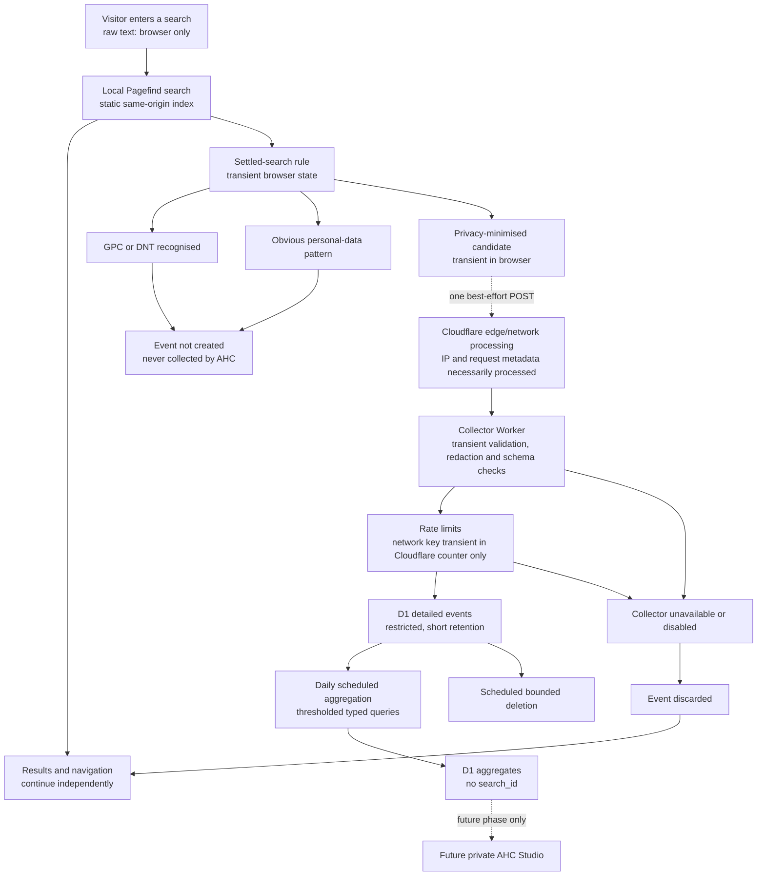

# Phase 1B — Privacy-Safe Search Analytics

| Field | Value |
| --- | --- |
| Parent blueprint | [AHC Publication Intelligence Studio](ahc-publication-intelligence-studio.md) |
| Status | Proposed for human approval |
| Version | 0.1 |
| Date | 27 July 2026 |
| Scope | Design gate only |
| Runtime status | Not implemented |
| Owner | Australian Home Collective |

## 1. Purpose, authority and boundary

This specification defines an implementation-ready design for privacy-minimised internal search analytics. It refines the Phase 1B contract in the parent blueprint without approving implementation or changing the Studio's product scope.

This document does not provide legal advice or claim that Australian Home Collective complies with any law. The owner must approve the final privacy wording, retention settings and production configuration before collection begins, and should obtain professional advice where appropriate.

This design gate creates no runtime capability. In particular:

- no D1 database, Worker, Worker route, Pages Function, Wrangler configuration, migration or secret exists as a result of this document;
- `public/_routes.json` continues to invoke only `/api/contact`;
- Pagefind continues to search locally and emits no search event;
- the public search page and Privacy Policy remain unchanged;
- no private Studio dashboard is started; and
- every value described as recommended remains subject to the owner decisions in section 20.

## 2. Evidence and current baseline

### 2.1 Repository state inspected

The repository was inspected at Phase 1A release commits:

- `147791f1075098f6e74f0a5afddcc01564ca9cb5` — Pagefind search implementation; and
- `81c84df0e34e436596833fd1b0b1ca2ba806a2fd` — supported wording for curated suggestions.

The current state is:

- Astro generates a static site. There is no server adapter.
- Pagefind `1.5.2` indexes 98 active guides and ten populated category hubs after the Astro build.
- `/search/` is `noindex,follow`, keeps typed terms out of the URL and currently states that words stay in the browser.
- Pagefind Component UI waits 300 ms before it searches.
- The six buttons under **Suggested searches** are manually curated and call the same local Pagefind instance.
- `functions/api/contact.js` is the only Pages Function.
- `public/_routes.json` contains only `/api/contact`.
- `public/_headers` already permits same-origin connections through `connect-src 'self'`.
- The Privacy Policy separately describes contact submissions, Turnstile and GA4.
- Cloudflare Pages watches `main`, runs `npm run build` and publishes `dist`.
- GitHub Actions builds and audits the site but does not deploy it.
- There is no Wrangler file, D1 resource, Worker source, search-event route or search-analytics dependency.

Live routing was also checked on 27 July 2026:

- the canonical non-`www` search page returned `200`;
- `www` redirected to the non-`www` canonical host with `301`;
- `HEAD /api/contact` returned `405` with `Allow: POST`; and
- `/api/search-events` returned the site's existing `404`.

These live observations are evidence about the current deployment, not a promise that a future Worker route will coexist correctly. The checks in sections 3.3 and 19 are mandatory before activation.

### 2.2 Current platform findings

Current official Cloudflare documentation establishes the following design constraints:

- Pages Functions can bind to D1.
- Cloudflare's current Pages-to-Workers compatibility table lists D1 for both products, but lists Rate Limiting bindings and Cron Triggers for Workers only.
- Worker route patterns can target an exact host and path. The most specific matching route wins.
- A Custom Domain makes the Worker the origin for the whole hostname, whereas a Worker Route runs in front of an existing origin. The collector is not the site's origin, so a narrow Worker Route is the appropriate proposed mechanism.
- Worker Rate Limiting counters are local to a Cloudflare location, permissive and eventually consistent. They are not an accounting system.
- Cloudflare advises against treating an IP address as a user identity because mobile, privacy and shared networks can place many people behind one address.
- Workers Logs can contain invocation request, response and related metadata. Application log discipline cannot eliminate Cloudflare's platform-level processing.
- D1 supports the `oc` Oceania location hint. A hint requests a nearby primary location but does not guarantee a location. The supported jurisdiction controls are currently `eu` and `fedramp`, not Australia.

Current Pagefind Component UI documentation exposes `search`, `loading`, `results`, `filters`, `error` and `translations` instance events. It documents a default 300 ms input debounce and programmatic `triggerSearch`. It does not document a dedicated result-click event. A later implementation must therefore test result-link event handling against the installed version rather than assume a private Pagefind API.

## 3. Architecture decision record

### 3.1 Decision status

| Field | Value |
| --- | --- |
| Decision | Recommend option A, subject to owner approval and route proof |
| Status | Pending owner approval |
| Proposed collector | Dedicated Cloudflare Worker |
| Proposed endpoint | `POST https://australianhomecollective.com.au/api/search-events` |
| Proposed production route pattern | `https://australianhomecollective.com.au/api/search-events` |
| Public-site dependency | None; event submission is optional and best effort |

The exact route has no wildcard. Requests with a query string, trailing slash or suffix are not part of the contract. The collector must still verify the exact scheme, host, path and absence of a query or fragment in application code.

### 3.2 Options compared

| Consideration | A. Dedicated Worker | B. Pages Function plus WAF | C. Pages Function plus D1 coarse throttle |
| --- | --- | --- | --- |
| Privacy | Narrow process with only search-event bindings; platform network processing still occurs. | Same event fields, but the collector is deployed with the public Pages project and contact Function. | Same event fields; D1 counter adds operational writes but no visitor/network identifier. |
| Abuse resistance | Native Worker Rate Limiting plus a D1 accepted-request ceiling. Strongest of the three, but still not authentication. | Requires proof that a suitable zone WAF rate-limiting rule is available on the account plan. | Weakest. A D1 ceiling limits accepted writes but can itself be pressured and cannot fairly distinguish clients. |
| Rate-limiting capability | Worker Rate Limiting binding is supported. Counters remain local and eventually consistent. | The binding is not supported by Pages; use a separately verified zone WAF rule. | No binding. Application and D1 controls only. |
| Scheduled cleanup | A `scheduled()` handler and Cron Trigger can aggregate then delete. | Pages does not support Cron Triggers; requires another Worker or external scheduler. | Same separate-scheduler requirement as B. |
| Same-origin submission | Yes, through one route on the canonical host. | Yes, through Pages file routing. | Yes, through Pages file routing. |
| Browser compatibility | Ordinary same-origin `fetch`; independent of Pagefind internals except documented search/results state and tested result links. | Same. | Same. |
| Isolation from Pagefind | Collector failure is a separate Worker failure and the client never awaits it for search. | Client remains non-blocking, but collector code ships with the Pages deployment. | Same coupling as B. |
| Isolation from `/api/contact` | Different deployment, route, bindings and logs. | Different Function file but the same Pages Functions deployment and quota. | Same coupling as B and a shared D1-throttle concern if implemented carelessly. |
| Deployment complexity | Moderate: Worker project, D1, bindings, manual route and deployment workflow. | Lower initial code placement, but adds WAF and a separate scheduler. | Lowest initial platform configuration, with the highest abuse and poisoning risk. |
| Rollback | Disable the event flag or remove one Worker route without redeploying Pagefind or contact. | Revert/redeploy Pages Functions; WAF and scheduler require separate rollback. | Revert/redeploy Pages Functions and disable the D1 ceiling. |
| Preview/production separation | Separate Worker names, D1 databases, bindings and routes are explicit. | Pages preview/production bindings exist, but Function code remains coupled to each Pages deployment. | Same as B; a mistaken binding creates a material contamination risk. |
| Observability | Collector-specific metrics and coded logs; invocation logs can be disabled. | Function logs sit in the Pages project and require careful separation from contact operations. | Same as B, plus D1-throttle diagnostics. |
| Cost/free tier | Worker requests share the Workers account quota; D1 has separate row/storage limits. Only the exact event route invokes the Worker. | Pages Function requests use the same Workers request quota. Static Pages requests remain free, but this Function route is dynamic. | Same request and D1 cost model; abusive traffic reaches D1 earlier. |
| Plan dependence | Rate Limiting binding support is documented for Workers; actual account limits and billing still require dashboard verification. | Production readiness depends on proof of a suitable zone WAF rule and its plan-specific characteristics. | Does not depend on WAF, but accepts materially weaker protection. |
| Future private Studio | Public write-only Worker can remain separate from a future private read API. | Future private APIs must be kept out of the public Pages Function surface. | Same concern as B, with a throttle table that must not become a visitor model. |

As checked on 27 July 2026, the published Workers Free allowance is 100,000 requests per day. Workers Paid has a US$5 monthly minimum including 10 million requests per month, followed by usage pricing. Pages Functions consume Workers quotas; ordinary static Pages asset requests do not. The published D1 Free allowance is five million rows read and 100,000 rows written per day, with 5 GB total storage. These are platform limits, not a capacity target or a promise about AHC's account. Reconfirm the active account plan, bundled usage and prices before creating any resource.

### 3.3 Recommended architecture and route coexistence

The recommended flow is:

```text
Dedicated collector Worker
→ exact canonical-host Worker Route
→ validation and privacy controls
→ native Rate Limiting bindings
→ production D1
→ daily Worker Cron Trigger
→ aggregation and deletion
```

The proposed Worker Route is not a Worker Custom Domain. Cloudflare Pages remains the origin for the host and continues to serve every non-matching path.

Required coexistence:

- `https://australianhomecollective.com.au/api/search-events` invokes only the collector Worker.
- `/api/contact` does not match that route and continues to invoke `functions/api/contact.js` through the Pages project.
- `public/_routes.json` remains unchanged. It governs Pages Functions invocation inside the Pages deployment; it is not the Worker Route configuration.
- No route is attached to `www.australianhomecollective.com.au`. The existing `301` to the canonical non-`www` host remains the only approved `www` behaviour.
- No route is attached to a `pages.dev` preview. Public Pages previews keep browser telemetry disabled.
- The preview Worker uses a separate preview D1 database and a preview-only URL for synthetic testing. It must never accept or forward real production traffic.

Before production activation, a human must verify in the Cloudflare dashboard:

1. The Pages custom domain and DNS record are still active and proxied.
2. The Worker has only the exact intended route and no broad host wildcard.
3. No competing Worker Route has equal or greater specificity.
4. The `www` redirect rule remains active and no Worker is attached to `www`.
5. Production and preview Worker names, D1 IDs and binding IDs are different.
6. `/api/contact` remains part of the Pages deployment and its Pages binding configuration is unchanged.

Then verify live, before enabling browser submission:

1. Unrelated public pages and Pagefind assets still return their existing content.
2. `/api/contact` still returns `405` to a non-POST request with `Allow: POST`.
3. `GET /api/search-events` returns the collector's generic `405` with `Allow: POST`.
4. A synthetic valid POST returns `204`; malformed, oversized and rate-limited fixtures return the designed codes.
5. The endpoint with a trailing slash, suffix or query string is not accepted.
6. `www` still redirects to the canonical host.
7. Removing the Worker Route returns the endpoint to the existing Pages `404` without affecting search or contact.

If any dashboard or live-routing check fails, do not enable browser collection.

## 4. Data-flow and trust boundaries



Trust and storage distinctions:

| Data | Treatment |
| --- | --- |
| Raw keystrokes, empty state, one-character state | Used only by local Pagefind; never submitted or stored by AHC search telemetry. |
| Pending timer, current query and current result snapshot | Transient browser memory only. |
| GPC/DNT state | Read transiently to skip telemetry; never submitted as an analytics field or stored. |
| IP address and request metadata | Necessarily processed by Cloudflare to receive, route and protect the request; not added to the event schema, D1 or application logs. |
| Rate-limit network key | May use request network information transiently inside a deliberately high-threshold Cloudflare counter; never used as analytics or stored in D1/application logs. |
| Accepted query values and click paths | Restricted D1 data for the approved detailed-event period. |
| Thresholded query aggregates | Restricted analytical data with no search ID, retained only for the approved aggregate period. |
| Rejected body | Discarded without reflection or application logging. |

## 5. Privacy position

### 5.1 Required distinctions

- Cloudflare necessarily processes network information such as IP addresses when it receives, protects and routes an HTTP request.
- AHC must not add an IP-address field, network prefix, country, user agent, cookie ID or fingerprint to the event contract or deliberately persist those values in D1.
- Application code must not log request headers, bodies, raw queries, redacted queries, result paths or D1 rows.
- Cloudflare account-level Workers Logs, real-time tails, traces, Logpush, HTTP logs and retention settings are separate controls. The application cannot honestly state that Cloudflare never processes an IP address.
- No persistent visitor identifier, browser fingerprint, search cookie, `localStorage`, `sessionStorage` or IndexedDB record is permitted.
- `search_id` is created for one settled search and may link that search to one or more result clicks. It does not survive a page load and must not be repurposed as a session identifier.
- Pattern-based screening reduces risk but cannot reliably detect every name, street address, health matter or uniquely identifying free-text query.
- A rare query can therefore remain personal information in context even after obvious-pattern checks. Detailed retention is short, long-term query aggregation is thresholded and future display is private and restricted.
- Neither accepted events nor aggregates may be described as anonymous. The supported wording is **privacy-minimised** and **not linked to a persistent visitor identifier**.

### 5.2 OAIC position relevant to this design

The OAIC currently describes a small business as one with annual turnover of $3 million or less. Most small businesses are not covered by the Privacy Act 1988, but exceptions include health service providers, businesses that trade in personal information, Commonwealth contracted service providers, related covered businesses and businesses that opt in, among others. The repository does not establish AHC's turnover, activities or legal status, so this design makes no conclusion about whether an exemption applies.

For an APP entity, OAIC guidance requires a clearly expressed and up-to-date privacy policy and recommends privacy protections be planned before collection. Updated APP 3 guidance emphasises proportionality, data minimisation and collecting only personal information reasonably necessary for the entity's functions or activities.

OAIC guidance also says whether information is personal information depends on whether a person is identified or reasonably identifiable in the circumstances. Technical information such as an IP address, and information generated or inferred from other information, may be personal information depending on context. A search term that appears harmless in isolation may become identifying when combined with a rare topic, time or other data.

The design therefore uses a narrow improvement purpose, no visitor profile, no network identifier in AHC storage, transparent draft wording, short detail retention and restricted aggregates. These are design controls, not a legal-compliance conclusion.

The owner must approve the final privacy wording and retention settings, and confirm whether professional privacy advice is required, before production collection.

## 6. Search-event contract — schema version 1

### 6.1 Request envelope

One endpoint accepts one allowlisted JSON envelope:

```json
{
  "schema_version": 1,
  "events": []
}
```

Rules:

- `schema_version` is the integer `1`.
- `events` contains either one `search_performed` event or an ordered pair of one `search_performed` followed by one associated `result_clicked`.
- A click-only request is accepted only when its parent already exists and matches `site_id`; the browser should use the combined pair to avoid the parent race.
- More than two events, mixed schema versions, unknown fields, unknown event types or an invalid order are rejected.
- The complete UTF-8 request body is at most 2,048 bytes.

### 6.2 `search_performed`

| Field | Wire type and limit | Authority, validation and storage |
| --- | --- | --- |
| `event_type` | String; exact `search_performed` | Required allowlisted value. |
| `schema_version` | Integer; exact `1` | Required and must match the envelope. |
| `search_id` | String; 36 ASCII characters | Lower-case RFC 4122 UUID v4 generated with `crypto.randomUUID()` for this settled search. Primary idempotency key. |
| `site_id` | String; exact `ahc` | Fixed initial site. Never inferred from a visitor. |
| `redacted_query` | String; 2–120 Unicode code points after controls | An untrusted browser-screened candidate. The server independently applies Unicode, length and personal-pattern controls before storing the post-control value. |
| `normalised_query` | String; 2–120 Unicode code points | Browser-proposed NFC, trimmed, whitespace-collapsed and `en-AU` lower-case value. The server recomputes it and rejects a mismatch; only the server result is stored. |
| `result_count` | Integer; `0`–`1000` | Untrusted Pagefind telemetry. Bounds are validated, but the value is never represented as independently verified. |
| `search_context` | String; `typed` or `curated_suggestion` | Stored as a separate dimension. Initial recommended client behaviour emits `typed` only. |
| `occurred_at` | Not accepted from the client | The Worker generates an authoritative UTC ISO 8601 timestamp after validation. Any client timestamp or unknown timestamp field is rejected. |

No client sequence number is needed. Request order is represented by the two-element envelope, and idempotency uses the event IDs.

### 6.3 `result_clicked`

| Field | Wire type and limit | Authority, validation and storage |
| --- | --- | --- |
| `event_type` | String; exact `result_clicked` | Required allowlisted value. |
| `schema_version` | Integer; exact `1` | Required and must match the envelope. |
| `click_id` | String; 36 ASCII characters | Lower-case UUID v4. Primary idempotency key. |
| `search_id` | String; 36 ASCII characters | Must refer to the paired or existing search with the same `site_id`. |
| `site_id` | String; exact `ahc` | Required and foreign-key constrained. |
| `result_path` | String; maximum 300 ASCII characters | Relative same-site path matching `^/(guides|categories)/[a-z0-9]+(?:-[a-z0-9]+)*/$`. No origin, scheme, query string, fragment, encoded separator or control character. |
| `result_position` | Integer; `1`–`1000` | Must not exceed the paired search's non-zero `result_count`. It remains untrusted client telemetry. |
| `occurred_at` | Not accepted from the client | The Worker generates the authoritative UTC timestamp. |

The parent blueprint's conceptual `result_url` is refined here to `result_path`. This is a safety clarification: the collector never needs an origin, query string or fragment.

The future Studio must render all query and path values as text, never as HTML. A path may be offered as a link only after the private server repeats the route-pattern check and joins it to AHC's fixed canonical origin.

### 6.4 Idempotency and rejection

- `search_id` and `click_id` are their event idempotency keys.
- The server derives a SHA-256 fingerprint from each canonical, post-control payload and stores it for conflict comparison.
- Repeating an ID with an identical canonical fingerprint succeeds idempotently with `204` and does not increment aggregates twice.
- Repeating an ID with different fields is rejected as `400 invalid_event`; no existing row is changed and no submitted value is reflected.
- The combined search-plus-click write is a D1 batch. The parent is inserted or confirmed before the child, and a failure rolls back the batch.
- A click with no matching parent is rejected. The client does not retry indefinitely.

### 6.5 Curated suggestions

Recommended initial treatment: **do not log curated suggestion searches or their clicks**.

Rationale:

- the terms are chosen by AHC, so counts reflect site promotion as well as visitor intent;
- including them would make organic demand rankings easy to misstate;
- excluding them reduces collection and gives the first release a clearer purpose; and
- suggestion usability can be reviewed manually until there is an approved, separately labelled measurement need.

The schema reserves `curated_suggestion` so a later owner-approved experiment does not require redefining the meaning of `typed`. Initially:

- the browser does not submit an event for a suggestion activation;
- `COLLECT_CURATED_SUGGESTIONS` is `false`;
- if the collector receives a structurally valid curated event while the switch is false, it returns `204` and discards it without logging; and
- organic reports always filter `search_context = 'typed'`, even if curated collection is approved later.

AHC must never claim a term is popular because AHC placed it in the suggestion list.

## 7. Settled-search definition and click race

### 7.1 Approaches considered

| Approach | Benefit | Limitation | Decision |
| --- | --- | --- | --- |
| Explicit Enter | Strong deliberate signal. | Pagefind's documented Component UI event list does not expose an Enter-specific submission event; pointer and assistive input may never press Enter. | Do not use as the sole rule. |
| Curated activation | Clearly deliberate. | AHC selected the term, so it is not organic demand. | Do not log initially. |
| Second inactivity window | Works with Pagefind's normal UI and captures no-click searches. | A pause can still be a partial term; timing must be conservative. | Use for typed searches. |
| Result-click-triggered | A click is strong evidence that the shown query was useful enough to navigate. | The parent may not yet be stored and navigation must not wait. | Use in the hybrid rule with a combined batch. |
| Hybrid | Captures no-click and clicked settled searches while keeping navigation non-blocking. | Requires careful in-memory state and idempotency. | Recommended. |

### 7.2 Exact recommended initial rule

For a typed query:

1. Pagefind performs its existing local search after the existing 300 ms debounce.
2. When the documented Pagefind `results` event arrives, the client captures the normalised term and result count in memory and starts a separate 1,200 ms settlement timer.
3. Any `search`, `loading` or later `results` event for a changed term cancels the pending timer.
4. The timer is eligible only when the term is unchanged, contains 2–120 accepted code points, the result snapshot still belongs to that term, no recognised opt-out signal is present and no personal-data pre-screen rule fired.
5. The same normalised term is emitted at most once during one `/search/` page view. The in-memory set is destroyed on navigation or reload and is never written to browser storage.
6. When eligible, create one `search_id` and submit one event without awaiting it in the Pagefind result path.
7. Search results are displayed as soon as Pagefind produces them. The additional timer never delays rendering.

Never log:

- page load;
- initial empty state;
- one-character state;
- every keystroke;
- a cancelled timer;
- repeated renders of an unchanged query;
- a query rejected by privacy controls; or
- a curated suggestion under the initial recommendation.

### 7.3 Click before parent storage

If an approved result link is activated before the 1,200 ms timer completes or before its request is known to have completed:

1. Read the last matching Pagefind result snapshot already in memory.
2. Create the same one-search `search_id` if one does not yet exist.
3. Create a new `click_id`.
4. Send one combined envelope containing the parent search followed by the click.
5. Use one non-blocking `fetch` with `keepalive: true`.
6. Do not await the request, prevent the link's default action or delay navigation.
7. Let server idempotency absorb a parent already accepted by the timer request.

If the combined request is lost, the click is lost. That is an accepted accuracy limitation; adding Queues, Durable Objects or a blocking navigation handshake is not justified for Phase 1B.

## 8. Personal-information screening and redaction

### 8.1 Browser pre-screen

The browser screen reduces the chance that obvious personal data leaves the device. It never alters or blocks local Pagefind results.

Before creating telemetry:

1. Require a JavaScript string with valid Unicode scalar values.
2. Apply NFC normalisation, trim ends and collapse Unicode whitespace.
3. Reject control characters, null bytes and unpaired UTF-16 surrogates.
4. Reject fewer than two or more than 120 code points.
5. Skip telemetry for any email-like string.
6. Skip telemetry for Australian or international phone-like strings, including 8–15 digits separated by common phone punctuation.
7. Skip telemetry for URL, scheme, `www` or domain-like strings.
8. Skip telemetry for a run of seven or more digits.
9. Skip telemetry for strings containing HTML-like angle-bracket constructs or obvious script markup.
10. Continue local Pagefind search unchanged for every skipped event.

The browser must not replace a matched token and send the remainder. The initial privacy-minimal rule is to skip the whole event, avoiding a misleading claim that partial redaction removed all identifying context.

### 8.2 Server enforcement

The server never trusts the browser. It:

- applies strict JSON decoding and an exact field allowlist;
- repeats Unicode, length, control, email, phone, URL, domain, digit-run and HTML-like checks;
- independently normalises the accepted query;
- rejects any client `normalised_query` that does not exactly match the server result;
- never stores or logs the rejected body;
- never returns the submitted value in a response; and
- persists only the server's post-control `redacted_query` and `normalised_query`.

The stored name `redacted_query` describes the value after the control boundary; it is not a promise that all personal information was found.

### 8.3 Known detection limits and compensating controls

Pattern rules cannot reliably detect:

- personal names;
- street or household addresses expressed as ordinary words;
- health conditions;
- family circumstances;
- rare combinations of otherwise ordinary words; or
- free text that becomes identifying only when combined with outside information.

Compensating controls are:

- no network, device or persistent visitor identifier;
- no client timestamp;
- minimal event fields;
- 60-day recommended detailed retention;
- a three-occurrence threshold before long-term query aggregation;
- no long-term search ID;
- private, text-only future display;
- no public raw-query display;
- owner-controlled deletion and emergency disablement; and
- no detailed-event export as a routine backup process.

Test fixtures must be synthetic, for example `alex.example@example.invalid`, `0412 345 678`, `https://example.invalid/private` and fictional address-like text. Never use a real person's information.

## 9. Retention, aggregation and D1 location

### 9.1 Detailed-event options

| Period | Low-traffic usefulness | Privacy exposure | Operational effect |
| --- | --- | --- | --- |
| 30 days | Good for short-term faults, but may be too sparse to distinguish repeated needs from one-offs. | Lowest of the options. | One monthly window; simple deletion. |
| 60 days | Roughly eight weeks of low-volume evidence and two monthly comparisons. | Less exposure than the parent blueprint's provisional 90-day target. | Still simple daily cleanup; enough time to form a 30-day threshold aggregate. |
| 90 days | Largest sample and one quarterly window, but still weak for annual seasonality. | Highest exposure, especially for unique free text. | More detailed rows, longer recovery copies and a larger incident boundary. |

Recommended initial period: **60 days**, pending owner approval.

This refines, but does not silently amend, the parent blueprint's provisional 90-day target. The parent blueprint explicitly requires a Phase 1B retention decision before collection. Sixty days is recommended because the site is currently low traffic, while 90 days adds a full extra month of rare-query exposure without providing a reliable seasonal comparison.

Clicks expire with or before their parent. The scheduled job aggregates first, deletes eligible clicks, then deletes their searches. `ON DELETE CASCADE` is a safety net, not a substitute for explicit candidate counts and deletion-order tests.

### 9.2 Long-term aggregation

Recommended rule, pending owner approval:

- only `typed` searches are eligible;
- a normalised query must occur at least **three times in a rolling 30-day window**;
- “three” means three accepted search events, not three people or households;
- one person can generate more than one event because there is deliberately no visitor identity;
- qualifying data is written into UTC weekly buckets;
- aggregates contain no `search_id` or `click_id`;
- event count, zero-result count, clicked-search count and click count remain separate;
- no missing bucket is displayed as zero without a successful aggregation-run record;
- query aggregates expire **25 months** after their bucket end, giving at most two annual comparisons plus one month;
- below-threshold queries are deleted with detail and do not create a long-lived query-text row;
- `typed` and `curated_suggestion` are never merged; and
- if curated collection is later approved, it uses separate aggregate rows and remains excluded from organic rankings by default.

Aggregation and deletion run daily at the proposed `03:17 UTC`. Each run:

1. records cut-offs and candidate counts in dry-run mode;
2. processes no more than 5,000 detailed rows per invocation;
3. upserts deterministic weekly aggregates;
4. deletes eligible click rows, then search rows;
5. removes expired query aggregates;
6. removes old ingest counters;
7. records exact affected counts and a coded outcome; and
8. is safe to repeat with the same cut-off.

### 9.3 Backups, exports and deletion

D1 Time Travel is always on for supported databases and currently permits recovery up to seven days on Workers Free or 30 days on Workers Paid. Deleted rows may therefore remain within Cloudflare's recovery boundary for that provider-controlled period.

Controls:

- do not create routine exports containing detailed search events;
- before a destructive migration, record a D1 bookmark and create an export only when the approved recovery plan genuinely requires it;
- give any detailed export the same or shorter expiry than the source data, encrypt it, restrict access and record deletion;
- never seed preview from a production export containing event detail;
- after a Time Travel restore, immediately rerun the approved retention dry-run and apply steps before reopening collection; and
- document that recovery copies cannot silently become indefinite archives.

### 9.4 Data location

Recommended creation hint: **`oc` (Oceania)**, pending owner approval.

The hint:

- asks D1 to place the primary near the preferred region by latency;
- is set only when the database is created; and
- may reduce write latency for an Australian workload.

It does not:

- guarantee Australia;
- create an Australian jurisdiction constraint;
- prevent Cloudflare network processing elsewhere;
- provide a legal data-residency conclusion; or
- guarantee that future replicas remain in Australia.

The initial design leaves D1 read replication disabled. Current D1 documentation says read replication distributes read-only copies across available regions unless a supported jurisdiction applies. A later proposal to enable it requires a new privacy and wording review.

Public wording must not claim Australian-only data residency.

## 10. Rate limiting and abuse controls

### 10.1 Layered controls

Recommended provisional thresholds:

| Layer | Proposed rule | Privacy and limitation |
| --- | --- | --- |
| Exact route and method | One HTTPS host/path; POST only; 2,048-byte JSON body. | Removes accidental surface but does not authenticate a client. |
| Browser cross-origin protection | No third-party CORS; require exact `Origin` and host; consider `Sec-Fetch-Site: same-origin` when present. | Origin, Referer and Fetch Metadata can be forged by non-browser clients. |
| Network limiter | `SEARCH_NETWORK_LIMITER`: 120 accepted attempts per 60 seconds for a transient `CF-Connecting-IP` key. | Deliberately high for shared/mobile networks; key exists only in Cloudflare's short-lived limiter and is never analytics, D1 or application-log data. |
| Route limiter | `SEARCH_ROUTE_LIMITER`: 600 attempts per 60 seconds for constant key `search-events`. | A local per-Cloudflare-location ceiling, not a true global counter. |
| D1 accepted-envelope ceiling | 5,000 accepted envelopes per UTC day in production; 500 in preview. | Global to that D1 database. It limits accepted data writes but still incurs bounded counter reads and cannot stop all denial-of-service cost. |
| Schema and idempotency | Exact fields, bounded values, UUID fingerprints and prepared statements. | Limits malformed and replay impact; cannot prove genuine reader intent. |
| Kill switches | Server `EVENTS_ENABLED`, client build flag and removable route. | Allows independent disablement without disabling Pagefind. |

The native Rate Limiting binding is permissive, local and eventually consistent. The thresholds are protective controls, not evidence of visitors, sessions or billing accuracy.

### 10.2 Transient network use

The high-threshold network limiter is justified only as an abuse control:

- it is evaluated before D1 writes;
- it does not contribute to a search report;
- it is never stored in D1 or application logs;
- the binding's 60-second window limits counter lifetime;
- the threshold allows many legitimate events from a shared household, office, carrier NAT or privacy proxy; and
- false positives result only in discarded optional telemetry. Pagefind remains fully functional.

If the native limiter is unavailable or its binding is missing, the collector fails closed with a generic `503`; it must not bypass the limiter and write events.

### 10.3 D1 ceiling and poisoning limits

The `ingest_windows` table provides the cross-location accepted-envelope ceiling. Increment it only after syntax and privacy validation. Once the limit is reached, return `429` and do not write event detail.

This ceiling is a last resort, not proof against distributed abuse. It can protect the number of accepted events and cap index writes, but attackers can still:

- consume Worker requests;
- cause D1 counter reads;
- send plausible but false typed queries; and
- distribute traffic across locations and networks.

Monitoring therefore treats sudden volume, zero-result and query-distribution changes as possible poisoning. No recommendation is generated automatically from search data.

Turnstile is not recommended for ordinary search events. Telemetry is optional, the user must not face a challenge to search, and the layered controls are less intrusive. If abuse later defeats them, disable collection and perform a new design review before proposing Turnstile.

For a Pages Function alternative, production readiness requires dashboard evidence that a suitable zone WAF rate-limiting rule is available and tested. Do not treat the Worker Rate Limiting binding as available to Pages.

## 11. API contract

### 11.1 Endpoint

```text
POST https://australianhomecollective.com.au/api/search-events
```

One endpoint is simpler than separate search and click endpoints and permits an atomic parent-plus-click batch.

### 11.2 Request requirements

- HTTPS only.
- Exact host `australianhomecollective.com.au`.
- Exact path `/api/search-events`.
- No query string or fragment.
- POST only.
- `Content-Type: application/json` with optional `charset=utf-8`.
- Maximum body 2,048 UTF-8 bytes, enforced before JSON parsing where the runtime permits.
- Exact schema and field allowlists.
- Exact `Origin: https://australianhomecollective.com.au`.
- No credentials, authorization cookie or search cookie.
- No third-party `Access-Control-Allow-Origin`.
- Origin and Referer checks are abuse signals only; they do not authenticate a client.

### 11.3 Responses

Every response includes `Cache-Control: no-store` and `X-Content-Type-Options: nosniff`.

| Status | Meaning | Body |
| --- | --- | --- |
| `204` | Accepted, idempotently repeated, or deliberately discarded by an opt-out or curated-event policy. | Empty. Never claim “recorded”. |
| `400` | Malformed JSON, invalid/unknown fields, unknown schema, invalid ID, value mismatch, rejected path or missing parent. | Generic coded JSON such as `{"ok":false,"code":"invalid_event"}`. |
| `403` | Host/origin policy rejected. | `{"ok":false,"code":"request_rejected"}`. |
| `405` | Method is not POST. | Generic body; `Allow: POST`. |
| `413` | Body exceeds 2,048 bytes. | Generic body. |
| `415` | Content type is not JSON. | Generic body. |
| `429` | Native limit or D1 accepted-envelope ceiling reached. | Generic body; optional coarse `Retry-After: 60`, never a visitor-specific value. |
| `503` | Collection disabled, required binding unavailable or D1 unavailable. | Generic body with no provider detail. |

The client ignores all statuses. It must not parse a success message, reflect the submitted term or show a “recorded” state.

### 11.4 Client transport

Recommended transport:

- a single same-origin `fetch`;
- `method: "POST"`;
- `headers: {"Content-Type":"application/json"}`;
- `body: JSON.stringify(envelope)`;
- `credentials: "omit"`;
- `cache: "no-store"`;
- a short 1,500 ms abort for a settled no-click event; and
- `keepalive: true` for a result-click combined batch, fired without awaiting navigation.

Do not retry automatically. Idempotency exists for race safety, not a retry loop.

`sendBeacon` is not recommended initially because `fetch` gives exact JSON headers, abort control and testable status behaviour. If implementation testing finds a material browser navigation-loss problem, a Blob-backed `sendBeacon` fallback may be proposed separately, with content-type, size and duplicate tests.

The current CSP already permits same-origin fetch through `connect-src 'self'`; no new origin is required. The implementation slice must assert this and must not broaden `connect-src`. A cross-origin preview collector is deliberately not supported, so no preview origin is added to CSP.

## 12. Minimal D1 design

This is SQL-compatible design material, not a migration.

### 12.1 Proposed definitions

```sql
CREATE TABLE sites (
  site_id TEXT PRIMARY KEY
    CHECK (site_id = 'ahc'),
  display_name TEXT NOT NULL
    CHECK (length(display_name) BETWEEN 1 AND 100),
  canonical_origin TEXT NOT NULL UNIQUE
    CHECK (canonical_origin = 'https://australianhomecollective.com.au'),
  timezone TEXT NOT NULL
    CHECK (timezone = 'Australia/Brisbane'),
  status TEXT NOT NULL
    CHECK (status IN ('active', 'disabled')),
  schema_version INTEGER NOT NULL
    CHECK (schema_version = 1),
  created_at TEXT NOT NULL,
  updated_at TEXT NOT NULL
);

CREATE TABLE ingest_windows (
  site_id TEXT NOT NULL,
  window_date TEXT NOT NULL,
  accepted_envelopes INTEGER NOT NULL DEFAULT 0
    CHECK (accepted_envelopes BETWEEN 0 AND 5000),
  limit_value INTEGER NOT NULL
    CHECK (limit_value BETWEEN 1 AND 5000),
  updated_at TEXT NOT NULL,
  schema_version INTEGER NOT NULL
    CHECK (schema_version = 1),
  PRIMARY KEY (site_id, window_date),
  FOREIGN KEY (site_id) REFERENCES sites(site_id) ON DELETE RESTRICT
);

CREATE TABLE search_events (
  search_id TEXT PRIMARY KEY
    CHECK (length(search_id) = 36),
  site_id TEXT NOT NULL,
  redacted_query TEXT NOT NULL
    CHECK (length(redacted_query) BETWEEN 2 AND 120),
  normalised_query TEXT NOT NULL
    CHECK (length(normalised_query) BETWEEN 2 AND 120),
  result_count INTEGER NOT NULL
    CHECK (result_count BETWEEN 0 AND 1000),
  search_context TEXT NOT NULL
    CHECK (search_context IN ('typed', 'curated_suggestion')),
  occurred_at TEXT NOT NULL
    CHECK (length(occurred_at) = 24),
  expires_at TEXT NOT NULL
    CHECK (length(expires_at) = 24),
  event_fingerprint TEXT NOT NULL
    CHECK (length(event_fingerprint) = 64),
  schema_version INTEGER NOT NULL
    CHECK (schema_version = 1),
  UNIQUE (search_id, site_id),
  FOREIGN KEY (site_id) REFERENCES sites(site_id) ON DELETE RESTRICT
);

CREATE INDEX idx_search_events_site_time
  ON search_events (site_id, occurred_at);
CREATE INDEX idx_search_events_site_query_time
  ON search_events (site_id, normalised_query, occurred_at);
CREATE INDEX idx_search_events_expiry
  ON search_events (expires_at);

CREATE TABLE search_clicks (
  click_id TEXT PRIMARY KEY
    CHECK (length(click_id) = 36),
  search_id TEXT NOT NULL,
  site_id TEXT NOT NULL,
  result_path TEXT NOT NULL
    CHECK (
      length(result_path) BETWEEN 1 AND 300
      AND substr(result_path, 1, 1) = '/'
      AND instr(result_path, '://') = 0
      AND instr(result_path, '?') = 0
      AND instr(result_path, '#') = 0
      AND (
        result_path GLOB '/guides/*/'
        OR result_path GLOB '/categories/*/'
      )
    ),
  result_position INTEGER NOT NULL
    CHECK (result_position BETWEEN 1 AND 1000),
  occurred_at TEXT NOT NULL
    CHECK (length(occurred_at) = 24),
  expires_at TEXT NOT NULL
    CHECK (length(expires_at) = 24),
  event_fingerprint TEXT NOT NULL
    CHECK (length(event_fingerprint) = 64),
  schema_version INTEGER NOT NULL
    CHECK (schema_version = 1),
  FOREIGN KEY (search_id, site_id)
    REFERENCES search_events(search_id, site_id)
    ON DELETE CASCADE
);

CREATE INDEX idx_search_clicks_search
  ON search_clicks (search_id);
CREATE INDEX idx_search_clicks_site_time
  ON search_clicks (site_id, occurred_at);
CREATE INDEX idx_search_clicks_site_path_time
  ON search_clicks (site_id, result_path, occurred_at);
CREATE INDEX idx_search_clicks_expiry
  ON search_clicks (expires_at);

CREATE TABLE search_query_aggregates (
  site_id TEXT NOT NULL,
  period_start TEXT NOT NULL,
  period_end TEXT NOT NULL,
  normalised_query TEXT NOT NULL
    CHECK (length(normalised_query) BETWEEN 2 AND 120),
  search_context TEXT NOT NULL
    CHECK (search_context IN ('typed', 'curated_suggestion')),
  search_count INTEGER NOT NULL
    CHECK (search_count >= 1),
  zero_result_count INTEGER NOT NULL
    CHECK (zero_result_count BETWEEN 0 AND search_count),
  clicked_search_count INTEGER NOT NULL
    CHECK (clicked_search_count BETWEEN 0 AND search_count),
  click_count INTEGER NOT NULL
    CHECK (click_count >= clicked_search_count),
  threshold_count INTEGER NOT NULL
    CHECK (threshold_count >= 3),
  lookback_days INTEGER NOT NULL
    CHECK (lookback_days BETWEEN 1 AND 366),
  generated_at TEXT NOT NULL,
  expires_at TEXT NOT NULL,
  schema_version INTEGER NOT NULL
    CHECK (schema_version = 1),
  PRIMARY KEY (
    site_id,
    period_start,
    normalised_query,
    search_context
  ),
  FOREIGN KEY (site_id) REFERENCES sites(site_id) ON DELETE RESTRICT
);

CREATE INDEX idx_search_aggregates_site_period
  ON search_query_aggregates (site_id, period_start);
CREATE INDEX idx_search_aggregates_expiry
  ON search_query_aggregates (expires_at);

CREATE TABLE retention_runs (
  run_id TEXT PRIMARY KEY
    CHECK (length(run_id) = 36),
  environment TEXT NOT NULL
    CHECK (environment IN ('local', 'preview', 'production')),
  mode TEXT NOT NULL
    CHECK (mode IN ('dry_run', 'apply')),
  status TEXT NOT NULL
    CHECK (status IN ('started', 'succeeded', 'failed', 'partial')),
  detailed_cutoff TEXT NOT NULL,
  aggregate_cutoff TEXT NOT NULL,
  search_candidates INTEGER NOT NULL DEFAULT 0
    CHECK (search_candidates >= 0),
  click_candidates INTEGER NOT NULL DEFAULT 0
    CHECK (click_candidates >= 0),
  aggregate_candidates INTEGER NOT NULL DEFAULT 0
    CHECK (aggregate_candidates >= 0),
  searches_deleted INTEGER NOT NULL DEFAULT 0
    CHECK (searches_deleted >= 0),
  clicks_deleted INTEGER NOT NULL DEFAULT 0
    CHECK (clicks_deleted >= 0),
  aggregates_deleted INTEGER NOT NULL DEFAULT 0
    CHECK (aggregates_deleted >= 0),
  error_code TEXT,
  source_commit TEXT NOT NULL
    CHECK (length(source_commit) = 40),
  started_at TEXT NOT NULL,
  completed_at TEXT,
  schema_version INTEGER NOT NULL
    CHECK (schema_version = 1)
);

CREATE INDEX idx_retention_runs_environment_time
  ON retention_runs (environment, started_at);
```

The application route check is stricter than the SQL prefix check and must use the exact regular expression in section 6.3. Database constraints are defence in depth.

Seed record:

```sql
INSERT INTO sites (
  site_id,
  display_name,
  canonical_origin,
  timezone,
  status,
  schema_version,
  created_at,
  updated_at
) VALUES (
  'ahc',
  'Australian Home Collective',
  'https://australianhomecollective.com.au',
  'Australia/Brisbane',
  'active',
  1,
  '<server-generated-utc-timestamp>',
  '<server-generated-utc-timestamp>'
);
```

### 12.2 Field classification and retention

| Table | User-originated fields | Restricted-data fields | Retention category |
| --- | --- | --- | --- |
| `sites` | None. | None; internal configuration only. | Retain while the site exists and during approved archive. |
| `ingest_windows` | None; count is operationally derived. | No visitor identifier; operational counts only. | Delete after 14 days. |
| `search_events` | `redacted_query`, client-reported `result_count` and `search_context`; ID is client-generated. | Both query fields and event ID are restricted. Result count/context remain untrusted. | Recommended 60 days. |
| `search_clicks` | `result_path`, `result_position` and IDs. | All event-level fields are restricted even though the path is public. | Same as or shorter than parent search. |
| `search_query_aggregates` | Normalised query is derived from user-originated text; counts derive from events. | Query text remains restricted despite thresholding. | Recommended 25 months from period end. |
| `retention_runs` | None. | No query, event ID, path, body, IP or header. | Recommended 25 months for operational proof. |

### 12.3 Database behaviour

- Use D1 prepared statements with bound values only. Never concatenate a submitted value into SQL.
- D1 enforces foreign keys by default. Migration tests must run `PRAGMA foreign_key_check` and fail on any row.
- Use D1 `batch()` for the accepted-envelope increment and event transaction where atomicity is required. A failed statement must roll back the batch.
- Duplicate identical IDs are no-op success. Conflicting duplicates are rejected without update.
- A click with a missing parent is rejected. The combined envelope is the normal browser path.
- A retry must reuse the same IDs and canonical payload; the browser does not create a new ID for the same attempted event.
- Partial writes are treated as a failed request and inspected through coded operational signals, never body logs.
- Local development uses a local D1 database.
- Preview and production use different physical databases, IDs and bindings.
- Production migrations are named, ordered and applied by database name, not an ambiguous binding.
- Before a destructive migration, record a Time Travel bookmark and make an approved export if needed. A down migration is written and tested where practical; otherwise rollback means disabling collection and restoring the recorded bookmark/export.
- No production database is seeded from preview data and no preview database is seeded from production events.

Deletion order:

1. aggregate eligible typed detail;
2. delete eligible `search_clicks`;
3. delete eligible `search_events`;
4. delete expired `search_query_aggregates`;
5. delete old `ingest_windows`;
6. retain `retention_runs` for operational proof; and
7. never automatically delete `sites`.

## 13. Logging and observability contract

### 13.1 Prohibited application logs

Application logs must never contain:

- raw or redacted query text;
- normalised query text;
- `search_id` or `click_id`;
- a request body;
- IP address or `CF-Connecting-IP`;
- full headers or Referer;
- full user agent;
- a submitted result path;
- a D1 row or prepared-statement binding;
- an exception that embeds a submitted value; or
- a hash of a query or network address.

### 13.2 Permitted coded logs

| Level | Codes | Allowed structured fields |
| --- | --- | --- |
| `info` | `retention_job_started`, `retention_job_completed` | Environment, schema version, source commit, bounded aggregate counts and duration bucket. |
| `warn` | `validation_failed`, `rate_limited`, `unknown_schema`, `daily_ceiling_reached` | Code, environment, schema version if valid, HTTP status and per-invocation operations correlation. |
| `error` | `d1_unavailable`, `rate_limiter_unavailable`, `retention_job_failed`, `migration_state_invalid` | Code, environment, scrubbed provider category, source commit and per-invocation operations correlation. |

Do not log every accepted event. Metrics should use aggregate request/status counts exposed by the platform or coded counters that do not contain visitor data.

The operations correlation is a random value created for one Worker invocation, never returned to the browser, never stored in D1 and never reused. It must not be derived from an event ID, query, IP, header or user agent.

### 13.3 Account-level review before activation

Cloudflare's platform may expose request metadata even when application code does not log it. Before production:

1. Review Workers Logs for the collector.
2. Set `observability.logs.invocation_logs = false`.
3. Confirm custom logs contain only allowlisted codes and fields.
4. Review the plan's Workers Logs retention; do not extend it through exports.
5. Confirm automatic traces are off unless a separate scrubbed review approves them.
6. Confirm no Tail Worker is attached.
7. Confirm Workers Trace Events Logpush is disabled for this Worker and no account-level job silently includes it.
8. Review zone HTTP Logpush/log-retention settings for the exact path.
9. Confirm no dashboard rule puts request bodies or headers into a custom field.
10. Record who can access Workers Logs, D1 and deployment settings.

### 13.4 Incident debugging

1. Disable collection if an incident may expose terms.
2. Reproduce only with a published synthetic query fixture.
3. Inspect coded errors, status counts, D1 row metrics and binding health.
4. Do not tail ordinary live visitor traffic to discover a term.
5. If a real row must be inspected, require owner approval, restrict the query to the minimum fields and do not copy it to tickets, chat or logs.
6. Record the incident outcome without event content.
7. Delete any approved temporary export and rerun retention checks before re-enabling.

## 14. Draft public wording — not approved and not published

The drafts below are exact proposed Australian-English copy for later human and legal review. The recommended numbers are not approved merely because they appear in the draft.

### 14.1 Proposed search-page notice

> Search runs locally in your browser using Pagefind. If you pause on a typed search or choose a result, we may record a privacy-minimised version of that settled search, the number of results and the result you selected. We use this information to improve our guides and navigation. We do not create a search cookie or persistent visitor identifier, and we do not intentionally retain obvious email addresses, phone numbers or web addresses. Search still works if this optional telemetry is unavailable.

This replaces the current statement that words stay entirely in the browser. It must not be published until the endpoint, privacy controls, approved policy and disable path are ready for the same release.

### 14.2 Proposed Privacy Policy section

Proposed heading: **Internal search analytics**

> Search results are generated locally in your browser using our self-hosted Pagefind index. We may also collect limited internal search information to help us understand where our guides and navigation could be clearer.
>
> We do not record each keystroke. After a typed search has settled, we may record a privacy-minimised version of the search, the number of results shown and, if you select a result, its relative page path and position. We do not create a search-specific cookie, browser fingerprint or persistent visitor identifier. Search information is not combined with contact-form messages or described as part of Google Analytics 4.
>
> Before a search event is sent, the browser checks for obvious patterns such as email addresses, phone numbers and web addresses and skips the event when one is found. Our server repeats these checks. These controls reduce risk but cannot guarantee that every name, address, health matter or other personal detail in free text will be detected. Please do not enter personal information into search.
>
> Cloudflare processes network information, including an IP address and request metadata, to receive, protect and route the request. Australian Home Collective does not add an IP address, full user agent or request headers to the search-event record and does not intentionally store them in its search database or application logs.
>
> Accepted detailed search events are stored in Cloudflare D1 for up to 60 days. Query text is retained in longer-term aggregates only when the same normalised typed query appears at least three times within a rolling 30-day period. Those aggregates do not contain a search identifier and are retained for up to 25 months. Curated suggestion-button searches are not collected in the initial release. Detailed records and expired aggregates are deleted by a scheduled process. Deleted information may remain temporarily within Cloudflare's platform recovery period.
>
> We request an Oceania location when creating the D1 database, but this is a location hint rather than an Australian data-residency guarantee. We do not claim that search information is stored only in Australia.
>
> If a recognised Global Privacy Control or Do Not Track signal is present, we skip search telemetry and local Pagefind search continues normally. Search also remains usable if the collector is disabled or unavailable.
>
> For questions about search information or this policy, use the [Contact page](/contact/).

### 14.3 Human/legal review checklist

- Confirm whether and how the Privacy Act applies to AHC; do not infer this from turnover alone.
- Approve the purpose as content and navigation improvement only.
- Confirm the draft describes Cloudflare processing separately from AHC D1 storage.
- Confirm it does not imply anonymity or perfect redaction.
- Approve 60-day detail and 25-month aggregate retention.
- Approve the three-in-30-days threshold.
- Confirm the D1 location statement makes no Australian-only claim.
- Confirm Time Travel/recovery wording is accurate for the active Workers plan.
- Preserve the existing separate contact, Turnstile and GA4 sections.
- Confirm the search-page notice and policy go live before or with collection, never after.
- Record an effective date and a substantive policy review date.

## 15. Global Privacy Control and Do Not Track

Recommended initial decision: **respect both signals**, pending owner approval.

Rationale:

- GPC is the newer privacy preference, but browser support is not universal.
- DNT is retired/deprecated and inconsistently supported, but honouring an explicit `1` is simple and privacy-beneficial.
- Skipping optional telemetry creates no operational problem and must not affect Pagefind.
- The preference can be respected without storing it.

Client rule:

```text
skip when navigator.globalPrivacyControl === true
or navigator.doNotTrack === "1"
or window.doNotTrack === "1"
```

Server defence:

- if `Sec-GPC: 1` or `DNT: 1` reaches the collector, return `204` without D1 access or an application log;
- do not store the signal;
- do not create an opt-out cookie; and
- recognise that Cloudflare has already processed the HTTP request at that point.

Tests:

- each recognised client signal produces no event request;
- Pagefind results and clicks still work;
- absent, `false`, `0`, `null` and unknown values do not falsely claim an opt-out;
- server headers cause discard even if a malformed client attempted submission;
- no preference value appears in D1 or application logs; and
- unsupported browsers continue to search without an error.

## 16. Threat model

### 16.1 Assets

- integrity of search-demand evidence;
- confidentiality of visitor-entered terms;
- D1 availability, row limits and cost;
- public-site and Pagefind availability;
- isolation of the contact form;
- integrity of production/preview separation;
- retention and deletion evidence; and
- future Studio decision quality.

### 16.2 Threat actors

- ordinary visitors making accidental mistakes;
- automated bots and generic scanners;
- deliberate data-poisoning actors;
- abusive high-volume or distributed clients;
- malicious cross-origin sites;
- malformed or obsolete clients;
- a person with compromised Cloudflare, GitHub or administrative credentials; and
- developers making implementation, migration, logging or routing mistakes.

### 16.3 Threat register

Likelihood and consequence are qualitative design estimates, not measured incident rates.

| Threat | Likelihood | Consequence | Preventive control | Detective control | Residual risk | Test | Rollback or disable response |
| --- | --- | --- | --- | --- | --- | --- | --- |
| Intermediate keystrokes collected | Medium without control | Partial private text is stored. | Log only the results event plus 1,200 ms stable window; cancel on change. | Test request spy; unexpected event-rate alert. | Timing can still settle a partial word. | Slow-type a fixture and assert only final term. | Disable client flag; remove route; delete affected window. |
| Email address submitted | Medium | Direct identifier enters D1. | Browser skip and independent server rejection of email-like text. | Synthetic privacy tests; no value in logs. | Obfuscated email may evade patterns. | Synthetic `.invalid` email variants. | Disable collection; identify/delete affected boundary without copying values. |
| Phone number submitted | Medium | Direct identifier enters D1. | Reject phone-like punctuation and 8–15 digit patterns; reject long digit runs. | Synthetic tests and restricted review. | Words or unusual formatting may evade patterns. | Australian/international synthetic numbers. | Same privacy incident disable/delete path. |
| URL or domain submitted | Medium | Private tokens or paths may be retained. | Reject schemes, `www`, domain-like patterns and long encoded forms. | Synthetic tests. | Novel or spaced forms may evade detection. | `.invalid`, localhost and encoded fixtures. | Disable, assess and delete affected period. |
| Personal name or address submitted | Medium | Rare free text may identify a person. | No claim of reliable detection; minimal fields, 60-day detail and thresholded aggregates. | Restricted aggregate review; owner deletion route. | Material; names and addresses can look ordinary. | Fictional ambiguous fixtures demonstrate that the system treats stored text as restricted. | Disable and bounded delete; do not attempt unsafe automatic classification. |
| Sensitive household or health query | Medium | Confidential circumstances could be inferred. | No persistent identity, short detail, threshold, private display and no public query output. | Restricted access review and rare-query counts, not content logs. | Sensitive meaning can remain in text. | Synthetic non-real sensitive-topic fixture and deletion test. | Disable; delete affected detail/aggregate; privacy review. |
| Forged Origin or Referer | High for non-browser client | Poisoning bypasses one browser-origin signal. | Exact host/origin, no CORS, Fetch Metadata where present, rate limits, validation and no claim of authentication. | Origin-rejection counts and poisoning review. | Headers remain forgeable. | Forge them and prove other controls still apply. | Tighten/disable route; do not claim client authenticity. |
| Replayed event | High for bots | Counts could inflate. | UUID idempotency and canonical fingerprint. | Duplicate/no-op count without IDs in logs. | A replay with fresh IDs remains poisoning. | Repeat identical envelope many times. | Disable on anomaly; delete bounded contaminated period. |
| Duplicate event from client race | Medium | Double counting. | Same IDs for timer/click parent; D1 idempotency. | Duplicate fixture and aggregate count. | Client bug may generate fresh IDs. | Race timer and combined click. | Disable client release; retain collector for verified old clients or remove route. |
| Fake result count | High for malicious client | False zero-result or supply signal. | Integer bounds and label as untrusted telemetry. | Compare distribution with deterministic synthetic Pagefind fixtures. | Cannot independently verify every visitor result state. | Submit boundary and implausible values. | Exclude suspect period; no automatic recommendation. |
| Fake result URL/path | High for malicious client | Poisoned links or future script/link abuse. | Exact relative guide/category regex, no origin/query/fragment, text-only rendering. | Invalid-path counts and manifest reconciliation later. | Plausible nonexistent same-pattern paths remain possible. | Cross-origin, query, fragment, traversal and nonexistent paths. | Disable click collection; discard affected clicks. |
| Fake result position | High for malicious client | Misleading ranking/click analysis. | Bound and require no greater than paired count; mark unverified. | Synthetic fixture comparisons. | Plausible false positions remain possible. | Negative, zero, over-count and high boundary values. | Exclude position metric; preserve search counts if sound. |
| Click fraud | Medium | False navigation preference. | Per-network/route ceilings, idempotency, anomaly review and no automated actions. | Click/search ratio and burst monitoring. | Distributed fraud remains possible. | Burst synthetic clicks with fresh IDs. | Disable click events while keeping settled searches or disable all telemetry. |
| Oversized request body | High for scanners | CPU/memory and log pressure. | 2,048-byte limit before parse; platform body limits are not the application limit. | `413` counts only. | Request still reaches Cloudflare. | Exact limit and limit-plus-one. | Route disable during flood. |
| Invalid Unicode, controls or null bytes | Medium | Parser inconsistency, corrupt display or bypass. | Strict UTF-8 JSON, scalar validation, NFC and rejection. | Coded validation count. | Cross-runtime edge cases. | Unpaired surrogate, null and control fixtures. | Disable affected schema version; patch before re-enable. |
| HTML or script-like input | High for scanners | Stored XSS if future Studio renders unsafely. | Reject obvious markup; prepared statements; text-only display; never unrestricted HTML. | Studio security tests and CSP. | Ordinary text can resemble markup; future developer error remains. | `<script>`, entities and template syntax as synthetic data. | Disable Studio display/collector; delete affected rows if needed. |
| SQL injection | High for scanners | Data corruption or disclosure. | Prepared statements only and strict types. | Test queries and D1 error-code review without values. | Developer regression. | Quotes, comments and SQL keywords remain inert data or are privacy-rejected. | Disable route; restore bookmark if mutation occurred. |
| Unknown or downgraded schema | Medium | Validation bypass or semantic mixing. | Exact envelope/event version `1`; reject unknown fields and versions. | `unknown_schema` coded count. | Old clients stop contributing. | Version `0`, `2`, string version and extra fields. | Disable obsolete client or collector version; no silent coercion. |
| D1 cost or quota exhaustion | Medium | Collector unavailable and possible cost. | Native limits before D1, accepted-envelope ceiling, indexes and bounded jobs. | D1 row metrics and ceiling alerts. | Counter reads and distributed Worker requests still cost. | Load test up to ceilings in preview only. | Set `EVENTS_ENABLED=false`; remove route; Pagefind continues. |
| Event poisoning with plausible queries | High | Bad editorial decisions. | No authentication claim; thresholds, source labelling, anomaly review and human decisions. | Sudden-volume/distribution checks and corroboration with other evidence. | Cannot prove independent readers without prohibited identity. | Synthetic concentrated-topic attack. | Quarantine/exclude date range; never auto-publish or auto-recommend. |
| Route flooding | Medium | Worker quota or availability impact. | Exact route, native limits, D1 ceiling and Cloudflare zone protections. | Worker request/status metrics. | Large distributed traffic can still consume quota. | Preview load test within authorised bounds. | Remove route immediately; browser failure stays invisible. |
| Cross-environment contamination | Low with controls | Test data affects production decisions. | Different names, databases, IDs, bindings, routes and CI environments. | Startup assertion and environment-labelled retention runs. | Misbound config/credential can bypass intention. | Production worker refuses preview DB/site marker and vice versa. | Disable both; isolate DBs; delete contaminated rows; correct bindings. |
| Preview data enters production | Medium without a gate | Synthetic events appear real. | Production browser flag off in previews; no Pages-preview route; no production export into preview. | Query DB/environment marker and deployment trace. | Manual API use can target wrong endpoint. | Synthetic marker must never appear in production. | Disable route and delete bounded marker period. |
| Raw event body enters application logs | Medium through error handling | Full query disclosure outside retention controls. | Never log request/error objects or parse failures with bodies; coded errors only. | Automated log-capture tests. | Runtime/platform metadata remains outside app control. | Malformed body with sentinel absent from captured logs. | Disable observability/route; purge export where possible; incident review. |
| IP address or headers enter application logs | Medium | Persistent network identifier and wider access. | Never log request, headers, IP or derived network hash; invocation logs off. | Static scan and captured-log assertions. | Cloudflare platform tools may still show metadata. | Sentinel headers absent from app logs; dashboard configuration review. | Disable logs/Logpush and collector; restrict access; incident review. |
| Over-retention | Medium through failed jobs | Privacy exposure beyond approved period. | Daily job, explicit `expires_at`, idempotent bounded deletion and run records. | Alert on oldest row and failed/missing runs. | Cloudflare Time Travel retains recovery history temporarily. | Advance clock in preview and verify oldest-row boundary. | Disable collection until backlog deleted and verified. |
| Deletion exceeds intended boundary | Low but severe | Valid data or configuration lost. | Dry-run, fixed predicates, row caps, child-first order, transaction and Time Travel bookmark. | Candidate/deleted comparison and foreign-key check. | A faulty approved predicate can still delete. | Boundary rows immediately before/at/after cut-off. | Stop job; disable route; restore bookmark; rerun retention after restore. |
| Curated suggestions treated as organic demand | High if collected | AHC promotion is mislabeled as reader popularity. | Do not collect initially; permanent context field and default typed-only reports. | Aggregate query asserts no silent merge. | A future report may ignore context. | Suggestion activation produces no request; fixture filters context. | Disable curated switch; delete/rebuild affected aggregates. |
| Missing or stale aggregates shown as zero | Medium | False conclusion that demand disappeared. | Retention-run state and freshness required; absence is unknown, not zero. | Data-health checks on last successful run. | Human may overlook a warning. | Fail aggregation and verify “stale/insufficient”, never zero. | Hide affected metrics; rerun from remaining detail where possible. |
| Compromised administrative credentials | Low, severe | Route, logs, D1 or retention altered. | Least-privilege tokens, MFA, protected GitHub environments, separate roles and audit logs. | Cloudflare/GitHub audit review and config drift checks. | Privileged compromise remains material. | Access review and credential-revocation exercise. | Revoke tokens, remove route, disable Worker, preserve evidence and rotate credentials. |
| Developer routing, logging or migration mistake | Medium | Public outage, contact interference, leakage or data loss. | Reviewable slices, exact route checks, tests, manual approval and bookmark/export before destructive changes. | Build audits, live route matrix and post-deploy config comparison. | Human review can miss a defect. | Failure-isolation, partial-migration and route-removal drills. | Revert deployment/config, remove route, restore D1 if required; Pagefind remains static. |

## 17. Test and acceptance contract for later implementation

### 17.1 Functional

- A typed settled search is recorded once.
- Intermediate and one-character queries are not recorded.
- Repeated results for an unchanged query do not create another event.
- A curated suggestion creates no event under the initial recommendation.
- If curated collection is later approved, it is classified separately.
- A valid result click is associated with its parent.
- A search with no click remains valid.
- A click before the parent request completes is handled by the combined idempotent batch.
- A missing-parent click is rejected without an orphan.
- Pagefind works when the collector is missing, disabled, rate-limited or returning every designed error.
- Results and result navigation are never delayed.

### 17.2 Privacy

- Synthetic email-like, phone-like and URL-like queries are not stored.
- Long digit runs, overlength text, invalid Unicode, nulls and controls are not stored.
- HTML-like text is never executed or rendered as HTML.
- Raw and controlled query sentinels are absent from application logs and responses.
- D1 contains no IP, network prefix, user agent, cookie, fingerprint or client timestamp.
- No search cookie, `localStorage`, `sessionStorage`, IndexedDB or persistent ID is created.
- `search_id` changes with a new settled search and is not reused across reload.
- GPC/DNT behaviour matches the approved decision.
- Curated terms are absent from organic demand.

### 17.3 Security and abuse

- Unknown fields, event types and schema versions are rejected.
- Wrong content type, GET, trailing slash, query string and oversized body are rejected or do not reach the route.
- Forged Origin does not bypass schema, privacy, rate and D1 controls.
- SQL-like input remains bound data and cannot alter schema/data.
- Identical duplicate IDs are idempotent.
- Conflicting duplicate IDs do not change the stored row.
- Invalid cross-site, scheme, query, fragment, traversal and encoded-separator result paths are rejected.
- Result count/position bounds are enforced.
- Network and route limits return `429` without affecting Pagefind.
- The D1 daily ceiling operates across simulated locations.
- A missing rate-limiter binding fails closed with `503`.

### 17.4 Retention

- Dry-run reports the exact candidate IDs/counts internally without logging IDs or queries.
- Rows just before, at and after each cut-off prove the time boundary.
- Clicks are removed before or with their parent.
- Aggregates are deterministic and idempotent.
- A query with one or two events never creates a long-lived query aggregate.
- Three events in the rolling 30-day window create one typed aggregate.
- Curated and typed events never merge.
- Repeated cleanup runs do not double-count.
- Rare-query detail expires.
- Aggregate expiry works at 25 months.
- Preview cleanup cannot access production.
- A Time Travel restore is followed by retention reapplication.

### 17.5 Failure isolation

Exercise:

- D1 unavailable;
- native rate limiter unavailable;
- Worker unavailable;
- `EVENTS_ENABLED=false`;
- malformed deployment;
- scheduled cleanup failure;
- partial migration;
- daily quota/ceiling reached;
- Cloudflare route removed; and
- accidental broad route caught before activation.

In every case, `/search/`, local Pagefind results, suggestion buttons, result navigation, public static pages and `/api/contact` remain usable.

### 17.6 Manual production acceptance

- Browser network panel shows no intermediate-query requests.
- Synthetic typed query sends one request after the approved settlement rule.
- A synthetic click does not delay navigation.
- GPC and DNT tests send no browser request.
- No cookie or browser storage entry appears.
- No CSP, CORS, console or mixed-content error appears.
- The exact endpoint and error matrix behave as approved.
- Worker and Pages deployment commits are recorded separately.
- Cloudflare logs/settings match section 13.
- D1 oldest-row and aggregate freshness checks pass.
- The public wording exactly matches the owner-approved text.

## 18. Deployment and configuration plan — design only

### 18.1 Repository placement

Keep the collector in this repository to preserve one auditable source history and avoid a second repository's access, dependency and release burden. Isolate it under:

```text
workers/search-analytics/
```

The public Pages build must not import Worker source. A dedicated GitHub workflow and working directory keep deployment separate.

Proposed files appear in the implementation contract in section 19. No file is created by this design gate.

### 18.2 Worker and database identities

| Resource | Preview | Production |
| --- | --- | --- |
| Worker | `ahc-search-collector-preview` | `ahc-search-collector-production` |
| D1 database | `ahc-search-analytics-preview` | `ahc-search-analytics-production` |
| D1 binding | `SEARCH_ANALYTICS_DB` | `SEARCH_ANALYTICS_DB` with a different database ID |
| Network limiter | `SEARCH_NETWORK_LIMITER` with preview namespace | Same binding name with different production namespace |
| Route limiter | `SEARCH_ROUTE_LIMITER` with preview namespace | Same binding name with different production namespace |
| Environment marker | `preview` | `production` |
| Accepted-envelope ceiling | 500/day | 5,000/day |
| Browser events | Disabled | Disabled until the approved activation slice |

Binding names can remain consistent in code, but every environment-specific resource ID is non-inheritable and must be declared separately.

### 18.3 Wrangler configuration policy

Proposed later file: `workers/search-analytics/wrangler.jsonc`.

It will define:

- top-level source and compatibility date;
- explicit `preview` and `production` environments;
- separate D1 and rate-limiter bindings for each;
- `workers_dev: true` only for preview synthetic tests;
- `workers_dev: false` for production;
- no production route until the route-activation slice;
- daily production Cron `17 3 * * *`;
- no preview Cron until scheduled tests are approved;
- `observability.logs.invocation_logs: false`;
- non-secret variables for environment, site ID, retention, thresholds and feature switches; and
- no Node compatibility flag unless implementation proves it necessary.

Set the initial compatibility date to the implementation date, commit it, review compatibility changes before later updates and test before deployment. Do not use a floating “latest” production behaviour.

The Worker Rate Limiting binding currently requires Wrangler `4.36.0` or later. At implementation, review and lock the then-current supported Wrangler release. Do not write a future version number into this design.

### 18.4 Preview URL policy

- Preview uses its isolated `workers.dev` deployment only for synthetic API acceptance.
- It is not linked from public pages, indexed or used for real AHC visitor data.
- The preview collector begins disabled and is enabled only during a bounded approved test.
- Public Pages previews keep their client telemetry flag off and do not gain cross-origin CSP or CORS allowances.
- No production D1 binding, route or secret is available to preview.

### 18.5 Variables, secrets and feature controls

Proposed non-secret variables:

- `ENVIRONMENT`;
- `SITE_ID`;
- `CANONICAL_HOST`;
- `EVENTS_ENABLED`;
- `COLLECT_CURATED_SUGGESTIONS`;
- `DETAILED_RETENTION_DAYS`;
- `AGGREGATE_RETENTION_MONTHS`;
- `AGGREGATE_MIN_COUNT`;
- `AGGREGATE_LOOKBACK_DAYS`;
- `MAX_DAILY_ENVELOPES`; and
- `SOURCE_COMMIT`.

The collector itself requires no application secret. GitHub deployment requires a least-privilege Cloudflare account ID and API token stored only in protected GitHub environment secrets. No value appears in Git, logs, D1 or this document.

Emergency controls:

1. Set `EVENTS_ENABLED=false` to stop D1 writes.
2. Remove the exact Worker Route to stop collector invocation and return the endpoint to Pages `404`.
3. Redeploy the static client with its build-time submission flag disabled.
4. Preserve or delete existing D1 data according to the approved incident/retention decision.

Pagefind needs no rollback and remains local throughout.

### 18.6 Deployment method

Recommended: a manual `workflow_dispatch` GitHub Actions workflow using protected preview and production environments.

Reasons:

- it preserves repository commit-to-deployment traceability;
- required reviewers can stop between implementation slices;
- preview and production secrets/approvals remain separate;
- the existing Pages Git deployment remains untouched; and
- Worker deployment is never an automatic consequence of every `main` push.

Cloudflare Workers Builds is a valid platform option, but its normal push-triggered deployment is not the initial recommendation because this phase requires explicit gates between source, resources, privacy copy and route activation.

Traceability record:

```text
source commit
→ GitHub workflow run and protected-environment approval
→ Worker version/deployment ID
→ D1 migration version and foreign-key check
→ route/dashboard verification
→ synthetic event acceptance result
```

### 18.7 Rollback and destructive change

- Code rollback deploys the last known-good Worker version.
- Ingestion rollback sets `EVENTS_ENABLED=false`.
- Routing rollback removes the one exact route.
- Client rollback disables the static feature flag and redeploys Pages.
- Schema rollback uses a tested down migration where safe or restores the pre-change Time Travel bookmark/export.
- Before destructive migration, export only when approved and record its deletion deadline.
- After restoring D1, rerun retention before reopening ingestion.
- No rollback may change `/api/contact`, `public/_routes.json` or Pagefind.

## Authoritative references checked

Checked 27 July 2026. Recheck at implementation because platform contracts, limits and legal guidance can change.

### Cloudflare

- [Pages Functions bindings](https://developers.cloudflare.com/pages/functions/bindings/)
- [Pages Functions configuration and environments](https://developers.cloudflare.com/pages/functions/wrangler-configuration/)
- [Pages Functions routing and `_routes.json`](https://developers.cloudflare.com/pages/functions/routing/)
- [Pages-to-Workers feature compatibility](https://developers.cloudflare.com/workers/static-assets/migration-guides/migrate-from-pages/)
- [Worker routes](https://developers.cloudflare.com/workers/configuration/routing/routes/)
- [Worker routes and Custom Domains](https://developers.cloudflare.com/workers/configuration/routing/)
- [Worker Custom Domains](https://developers.cloudflare.com/workers/configuration/routing/custom-domains/)
- [Workers Rate Limiting binding](https://developers.cloudflare.com/workers/runtime-apis/bindings/rate-limit/)
- [Cron Triggers](https://developers.cloudflare.com/workers/configuration/cron-triggers/)
- [Workers compatibility dates](https://developers.cloudflare.com/workers/configuration/compatibility-dates/)
- [Workers environments](https://developers.cloudflare.com/workers/wrangler/environments/)
- [Workers pricing](https://developers.cloudflare.com/workers/platform/pricing/)
- [Workers Builds](https://developers.cloudflare.com/workers/ci-cd/builds/)
- [GitHub Actions deployment](https://developers.cloudflare.com/workers/ci-cd/external-cicd/github-actions/)
- [Workers Logs](https://developers.cloudflare.com/workers/observability/logs/workers-logs/)
- [Workers real-time logs](https://developers.cloudflare.com/workers/observability/logs/real-time-logs/)
- [Workers Logpush](https://developers.cloudflare.com/workers/observability/logs/logpush/)
- [D1 data location](https://developers.cloudflare.com/d1/configuration/data-location/)
- [D1 pricing](https://developers.cloudflare.com/d1/platform/pricing/)
- [D1 limits](https://developers.cloudflare.com/d1/platform/limits/)
- [D1 prepared statements](https://developers.cloudflare.com/d1/worker-api/prepared-statements/)
- [D1 batches](https://developers.cloudflare.com/d1/worker-api/d1-database/)
- [D1 foreign keys](https://developers.cloudflare.com/d1/sql-api/foreign-keys/)
- [D1 migrations](https://developers.cloudflare.com/d1/reference/migrations/)
- [D1 Time Travel and backups](https://developers.cloudflare.com/d1/reference/time-travel/)
- [D1 import and export](https://developers.cloudflare.com/d1/best-practices/import-export-data/)

### Pagefind

- [Pagefind Component UI](https://pagefind.app/docs/search-ui/)
- [Pagefind custom components and instance events](https://pagefind.app/docs/custom-components/)
- [Pagefind input and 300 ms debounce](https://pagefind.app/docs/components/input/)
- [Pagefind result component and templates](https://pagefind.app/docs/components/results/)
- [Pagefind JavaScript search API](https://pagefind.app/docs/api/)

### OAIC

- [Small business guidance](https://www.oaic.gov.au/privacy/privacy-guidance-for-organisations-and-government-agencies/organisations/small-business)
- [APP guidelines](https://www.oaic.gov.au/privacy/australian-privacy-principles/australian-privacy-principles-guidelines)
- [APP 1 — open and transparent management](https://www.oaic.gov.au/privacy/australian-privacy-principles/australian-privacy-principles-guidelines/chapter-1-app-1-open-and-transparent-management-of-personal-information)
- [APP 3 — collection and data minimisation](https://www.oaic.gov.au/privacy/australian-privacy-principles/australian-privacy-principles-guidelines/chapter-3-app-3-collection-of-solicited-personal-information)
- [Key concepts and reasonable identifiability](https://www.oaic.gov.au/privacy/australian-privacy-principles/australian-privacy-principles-guidelines/chapter-b-key-concepts)
- [What is personal information?](https://www.oaic.gov.au/privacy/your-privacy-rights/your-personal-information/what-is-personal-information)
- [Tracking pixels and technical or inferred information](https://www.oaic.gov.au/privacy/privacy-guidance-for-organisations-and-government-agencies/organisations/tracking-pixels-and-privacy-obligations)

### Preference signals

- [Global Privacy Control](https://globalprivacycontrol.org/)
- [W3C retired DNT note](https://www.w3.org/TR/tracking-dnt/)

## 19. Implementation-ready Phase 1B contract

This contract is a future implementation prompt. It authorises nothing automatically.

### 19.1 Exact proposed files

| File | Future change |
| --- | --- |
| `workers/search-analytics/wrangler.jsonc` | Worker environments, bindings, variables, disabled-by-default flags, observability and later approved route/Cron configuration. |
| `workers/search-analytics/src/index.js` | Exact fetch and scheduled handlers; status/header contract. |
| `workers/search-analytics/src/validate-event.js` | Envelope, field, Unicode, personal-pattern, ID and result-path validation. |
| `workers/search-analytics/src/store-event.js` | Prepared D1 statements, fingerprints, idempotency, parent-plus-click batch and daily ceiling. |
| `workers/search-analytics/src/retention.js` | Dry-run, aggregation, bounded deletion and run records. |
| `workers/search-analytics/migrations/0001_phase_1b_search_analytics.sql` | Approved minimal schema and `ahc` seed. |
| `workers/search-analytics/tests/validation.test.mjs` | Field, privacy, Unicode, path and schema fixtures using Node's test runner. |
| `workers/search-analytics/tests/storage.test.mjs` | Idempotency, FK, batch, aggregation and retention tests against local D1. |
| `workers/search-analytics/tests/handler.test.mjs` | Method, headers, sizes, Origin, statuses, limits and failure isolation. |
| `scripts/audit-search-analytics-boundaries.mjs` | Assert no forbidden fields/log calls, exact route/config separation and unchanged contact route. |
| `.github/workflows/deploy-search-collector.yml` | Manual protected preview/production deployment and traceability record. |
| `src/pages/search/index.astro` | Later: settled-search state, GPC/DNT checks and disabled-by-default non-blocking submission; no Pagefind ranking or URL change. |
| `scripts/audit-pagefind-output.mjs` | Later: replace Phase 1A “no network call” rule with the exact approved endpoint/fields/failure-isolation contract. |
| `src/pages/privacy-policy/index.astro` | Later: owner-approved internal-search section kept separate from contact, Turnstile and GA4. |
| `public/_headers` | Expected no source-list expansion; retain `connect-src 'self'` and audit it. |
| `package.json` | Later: Wrangler dev dependency and exact Worker test/audit/deployment scripts. |
| `package-lock.json` | Later: exact resolved development dependency tree. |
| `README.md` | Later: concise manual Worker/D1 deployment, disable and routing notes without secrets. |

Files that must remain unchanged during Phase 1B implementation unless a new owner decision explicitly expands scope:

- `functions/api/contact.js`;
- `public/_routes.json`;
- Pagefind index scope, ranking, suggestions and result templates;
- sitemap content;
- public guide/category content; and
- private Studio files, which do not yet exist.

### 19.2 Exact routes and runtime resources

- Production endpoint: `POST https://australianhomecollective.com.au/api/search-events`.
- Production Worker Route: exact `https://australianhomecollective.com.au/api/search-events`.
- No `www` route.
- No Pages preview route.
- Preview synthetic URL: the isolated preview Worker's `workers.dev` version URL; never linked publicly.
- Worker names, databases and bindings: section 18.2.
- D1 migrations: `0001_phase_1b_search_analytics.sql` only for the minimum schema.
- Cron: production `17 3 * * *`, added only after retention dry-run approval.
- Database location hint: `oc`, set at creation only after owner approval.

### 19.3 Dependencies and scripts

Future dependency plan:

- no new browser or runtime library;
- retain existing Astro and Pagefind versions unless a separate maintenance task approves changes;
- add Wrangler as a development dependency, using a reviewed current release no earlier than `4.36.0`;
- use Node's built-in test runner; add no test framework unless local D1/runtime evidence proves it necessary; and
- commit the lockfile delta as part of the implementation slice that adds Wrangler.

Proposed scripts:

```text
test:search-analytics
audit:search-analytics
db:search:local:migrate
db:search:preview:migrate
db:search:production:migrate
deploy:search:preview
deploy:search:production
retention:search:local:dry-run
```

Remote migration and deployment scripts must name the environment/database explicitly. Production commands run only through a protected manual workflow.

### 19.4 Cloudflare manual configuration

1. Confirm account plan quotas and Worker Rate Limiting availability.
2. Create preview D1 with `oc`; record ID without data.
3. Create production D1 with `oc` only after owner approval.
4. Create distinct rate-limiter namespaces for each environment.
5. Store least-privilege deployment credentials in protected GitHub environments.
6. Deploy preview Worker with no production route and collection disabled.
7. Review Workers Logs, traces, tails, Logpush and zone logs.
8. Apply and verify preview migration and seed.
9. Apply and verify production migration only after preview acceptance and backup/bookmark plan.
10. Deploy production Worker with `workers_dev=false`, collection disabled and no route.
11. Add Cron only after retention dry-run approval.
12. Add the exact production route only in its own approved slice.
13. Run dashboard and live routing checks from section 3.3.
14. Enable the server and static client only after public wording is live.

### 19.5 Reviewable slices

Each slice stops for explicit human review. No slice authorises the next.

1. **Worker and local validation, no Cloudflare resource or route.** Add source, Wrangler, local schema and pure/unit tests with `EVENTS_ENABLED=false`.
2. **Preview D1 and automated privacy tests.** Create only preview resources, apply migration, test synthetic fixtures and retention dry-run.
3. **Search client behind a disabled flag.** Add settled-search and click logic; verify zero requests when disabled and full Pagefind failure isolation.
4. **Privacy wording approval.** Owner/legal review of search notice, Privacy Policy, GPC/DNT, retention and D1 location wording.
5. **Production resources and binding.** Create production D1 and limiters; apply migration; deploy disabled Worker with no route.
6. **Production route activation.** Add only the exact route with collection still disabled; run route/contact/static checks.
7. **Live telemetry verification.** Publish approved wording, enable client/server and use synthetic non-personal queries only.
8. **Retention verification.** Enable Cron after dry-run and boundary approval; verify run record and oldest-row checks.
9. **Phase 1B acceptance review.** Reconcile source commit, Worker deployment, Pages deployment, schema, route, public wording, logs, D1 data and disable drill.

### 19.6 Required acceptance and rollback

Implementation acceptance requires every test in section 17, owner-approved copy and values, a green public-site build, unchanged contact behaviour, preview/production separation, exact live routing, scrubbed logs, a successful synthetic event and a successful retention boundary test.

Rollback:

- client flag off and Pages redeploy;
- `EVENTS_ENABLED=false`;
- exact route removal;
- last known-good Worker version;
- retention-preserving D1 decision;
- Time Travel/export restore only with explicit approval;
- immediate retention reapplication after restore; and
- live proof that Pagefind and `/api/contact` remain unaffected.

Data deletion:

- routine scheduled deletion under the approved cut-offs;
- owner-triggered bounded deletion for an incident or policy change;
- aggregate rebuild after removing contaminated data;
- no indefinite detailed export;
- record Cloudflare recovery-window limitation; and
- verify oldest detailed, click and aggregate timestamps after deletion.

Checks requiring explicit human approval:

- every decision in section 20;
- any Cloudflare resource creation;
- any dependency addition;
- preview and production migrations;
- privacy-copy publication;
- CSP change, even though none is currently expected;
- Cron activation;
- Worker Route activation;
- server/client event enablement;
- a production synthetic event;
- a destructive migration, restore, export or exceptional deletion; and
- Phase 1B acceptance.

## 20. Required owner decisions

| Decision | Recommended value | Rationale | State |
| --- | --- | --- | --- |
| Selected collector architecture | Dedicated Cloudflare Worker with D1, native Rate Limiting and Cron | Best isolation, native controls and independent rollback. | Pending owner approval |
| Exact endpoint route | `POST https://australianhomecollective.com.au/api/search-events`; exact Worker Route with no wildcard | Same origin, narrow path, no contact or static-route overlap. | Pending owner approval |
| Detailed-event retention | 60 days | Balances current low traffic against rare-query exposure better than 30 or 90 days. | Pending owner approval |
| Aggregate retention | 25 months from weekly period end | Permits two annual comparisons without indefinite retention. | Pending owner approval |
| Minimum repetition threshold | At least three accepted typed events within rolling 30 days | Suppresses one-offs while acknowledging events are not verified people. | Pending owner approval |
| Treatment of curated suggestions | Do not collect initially; reserve separate `curated_suggestion` schema value | Avoids manufacturing or overstating organic reader demand. | Pending owner approval |
| GPC/DNT handling | Respect both; skip telemetry without storing the signal | Privacy benefit with no effect on Pagefind and no visitor preference record. | Pending owner approval |
| D1 location hint | `oc` (Oceania), read replication off initially | Closest supported hint; not an Australian jurisdiction or guarantee. | Pending owner approval |
| Privacy Policy wording | Section 14.2 after human/legal review | Separates internal search, Cloudflare processing, D1, GA4 and contact. | Pending owner approval |
| Search-page notice | Section 14.1 after human/legal review | Replaces the browser-only claim plainly without claiming anonymity. | Pending owner approval |
| Production log settings | Coded custom logs only; invocation logs, traces, tails and Logpush disabled/restricted as section 13 specifies | Avoids application content logs while acknowledging platform processing. | Pending owner approval |
| Production and preview separation | Separate Worker names, D1 databases, limiter namespaces, bindings, GitHub environments and no preview browser telemetry | Prevents synthetic or preview data from entering production. | Pending owner approval |
| Deployment method | Manual protected GitHub Actions workflow in the same repository | Strong traceability and explicit stop points without another repository. | Pending owner approval |
| Production activation date | Set only after slices 1–8, public wording, log review and live route proof pass | A date now would imply premature approval. | Pending owner approval |
